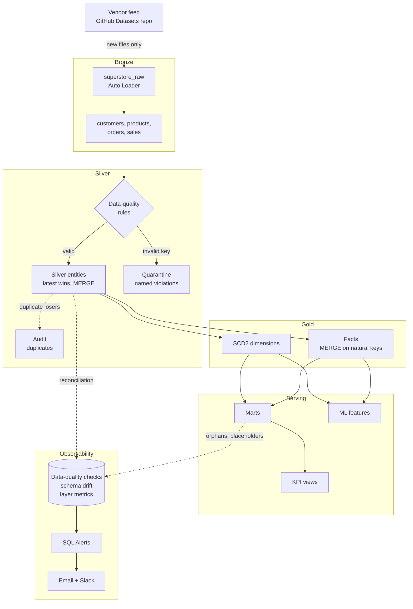

# Databricks Lakehouse Platform

[](https://github.com/111BM/databricks-lakehouse-platform/actions/workflows/deploy.yml)
[](https://github.com/111BM/databricks-lakehouse-platform/actions/workflows/integration-tests.yml)

An end-to-end **lakehouse on Databricks Serverless**: a medallion pipeline (Auto Loader → Bronze → Silver → Gold → marts, features and KPI views) built on the Superstore retail dataset, with SCD2 dimensions, data-quality quarantine, row-level reconciliation, alerting to Slack, and CI/CD that promotes the same code through **dev → qa → prod** under service-principal identities.

The dataset is small on purpose. The point is the platform engineering around it — and the [defects found by measuring what it produced](docs/DEFECTS_FOUND_BY_MEASUREMENT.md), most of which ran green.

---

## The five-minute tour

| # | Look at | What it shows |
|---|---|---|
| 1 | [Architecture](#architecture) and the [18-task job](resources/superstore_lakehouse_job.job.yml) | Medallion layers, one job definition for every environment, per-task timeouts and retries set from measured runtimes |
| 2 | [Silver module](src/superstore_silver/) + [severity tiers](docs/SEVERITY_TIERS.md) | Data quality as **routing, not filtering**: invalid keys quarantined with named violations, descriptive errors repaired and flagged, duplicates audited |
| 3 | [Reconciliation invariant](docs/RECONCILIATION_INVARIANT.md) + [alerts](docs/DATA_QUALITY_ALERTS.md) | `bronze == silver + quarantine + audit + superseded`, checked on every run (balanced on 1,010,534 rows in prod), with SQL Alerts to email and Slack |
| 4 | [Integration test](docs/TESTING_STRATEGY.md) + [CI/CD](docs/CI_CD_PIPELINE.md) | 288 unit tests, and a suite that seeds dirty data, runs the **real** pipeline twice, replays it, and asserts every layer before anything reaches prod |
| 5 | [Defects found by measurement](docs/DEFECTS_FOUND_BY_MEASUREMENT.md) | A pipeline that reported SUCCESS for three weeks while processing nothing — and the dozen quieter failures found the same way |

---

## Architecture




*A production run on 2026-10-07 (run `710265257759139`, 7 min 50 s, all 18 tasks green, as the prod service principal): source acquisition through Bronze, Silver and Gold to marts, features and KPI views. The same DAG runs in dev, qa and prod; only `SUPERSTORE_ENV` differs.*

Layer by layer, the cross-cutting design (config-driven contracts, environment isolation, run modes, observability) and the repository layout: **[docs/ARCHITECTURE.md](docs/ARCHITECTURE.md)**.

---

## Tech stack

| Area | Used |
|---|---|
| Compute and storage | Databricks Serverless, Delta Lake, Unity Catalog, Liquid Clustering, Predictive Optimization |
| Processing | PySpark, Auto Loader, Delta `MERGE`, SCD Type 2 |
| Deployment | Databricks Asset Bundles, GitHub Actions, service principals (OAuth M2M) |
| Quality and monitoring | Quarantine and audit tables, reconciliation, schema-drift detection, Databricks SQL Alerts, Slack |
| Testing | pytest on local Spark (288 tests), an end-to-end integration job on Databricks |
| Governance | Unity Catalog grants as Terraform, with plan-time policy checks |

---

## Results

| Measure | Value |
|---|---|
| End-to-end runtime at 3M source rows | **11 min 38 s**, down from 23 min 53 s ([how](docs/PERFORMANCE_INVESTIGATION.md)) |
| Slowest Silver entity after the date-parsing fix | 803 s → **158 s** |
| Prod reconciliation | balanced on **1,010,534** rows across four entities, checked every run |
| Unit tests / integration suite | **288** / about **40 min**, blocking every qa promotion |
| Personal access tokens in use | **0** — CI deploys as service principals, people sign in with OAuth |

---

## CI/CD

```
push to dev   ──► unit tests            (dev is deployed by the developer)
push to qa    ──► unit tests ──► deploy qa ──► integration test
push to main  ──► unit tests            (prod is NOT deployed)
Run workflow on main (by hand) ──► unit tests ──► deploy prod
documentation-only push ──► nothing
```

Each environment deploys under its own identity, one thing touches an environment at a time, and the toolchain is pinned. Gates, schedule, retries and the reasoning behind each: **[docs/CI_CD_PIPELINE.md](docs/CI_CD_PIPELINE.md)**.

---

## Getting started

```bash
git clone https://github.com/111BM/databricks-lakehouse-platform.git
cd databricks-lakehouse-platform

databricks auth login --host https://<your-workspace>.cloud.databricks.com
databricks bundle deploy --target dev
databricks bundle run superstore_data_platform --target dev

pytest tests/unit/ -v
```

Prerequisites, and first-time setup in a new workspace (service principals, Slack destination, secrets): **[docs/GETTING_STARTED.md](docs/GETTING_STARTED.md)**.

---

## Documentation

| Topic | Documents |
|---|---|
| Design | [Architecture](docs/ARCHITECTURE.md) · [Testing strategy](docs/TESTING_STRATEGY.md) · [CI/CD pipeline](docs/CI_CD_PIPELINE.md) · [Getting started](docs/GETTING_STARTED.md) |
| Data quality | [Severity tiers](docs/SEVERITY_TIERS.md) · [Value standardization](docs/VALUE_STANDARDIZATION.md) · [Reconciliation invariant](docs/RECONCILIATION_INVARIANT.md) · [Referential completeness](docs/REFERENTIAL_COMPLETENESS.md) · [Schema drift](docs/SCHEMA_DRIFT.md) · [SCD2 validity dating](docs/SCD2_VALIDITY_DATING.md) |
| Operations | [Run modes and backfill](docs/BACKFILL_QUICK_REFERENCE.md) · [Run-mode idempotency](docs/RUN_MODE_IDEMPOTENCY.md) · [Gold window alignment](docs/GOLD_WINDOW_ALIGNMENT.md) · [Data-quality alerts](docs/DATA_QUALITY_ALERTS.md) · [Freshness alert](docs/FRESHNESS_ALERT.md) · [Alert response](docs/ALERT_RESPONSE.md) |
| Identity and CI | [CI service principal](docs/CI_SERVICE_PRINCIPAL.md) · [Non-prod identity](docs/NON_PROD_IDENTITY.md) · [CI concurrency](docs/CI_CONCURRENCY.md) · [Unity Catalog grants](docs/UNITY_CATALOG_GRANTS.md) |
| Performance and layout | [Performance investigation](docs/PERFORMANCE_INVESTIGATION.md) · [Silver action collapse](docs/SILVER_ACTION_COLLAPSE.md) · [Integration test granularity](docs/INTEGRATION_TEST_GRANULARITY.md) · [Liquid Clustering migration](docs/LIQUID_CLUSTERING_MIGRATION.md) · [Dead optimisation code removal](docs/DEAD_OPTIMISATION_CODE_REMOVAL.md) |
| Engineering record | [Defects found by measurement](docs/DEFECTS_FOUND_BY_MEASUREMENT.md) · [Productionizing backlog](docs/PRODUCTIONIZING_BACKLOG.md) · [Platform constraints](docs/PLATFORM_CONSTRAINTS.md) |

---

## Platform constraints

The workspace is **Databricks Free Edition**: no account console, so no account groups, SCIM or OIDC federation, and one 2X-Small SQL warehouse. Each limit, what it blocks and what was done instead: **[docs/PLATFORM_CONSTRAINTS.md](docs/PLATFORM_CONSTRAINTS.md)**. Known gaps I would close before running this at real scale: **[docs/PRODUCTIONIZING_BACKLOG.md](docs/PRODUCTIONIZING_BACKLOG.md)**.

---

## Dataset

The classic [Superstore retail dataset](https://www.kaggle.com/datasets/vivek468/superstore-dataset-final) (orders, customers, products, sales). Source files are served from a separate repo, [`111BM/Datasets`](https://github.com/111BM/Datasets), one folder per environment, standing in for a vendor's file drop: adding a CSV there is all it takes for the next run to pick it up. The integration test uses a synthetic 9-row seed engineered to trip every data-quality rule.

## Author

**Biresh Tamang** — [github.com/111BM](https://github.com/111BM)
