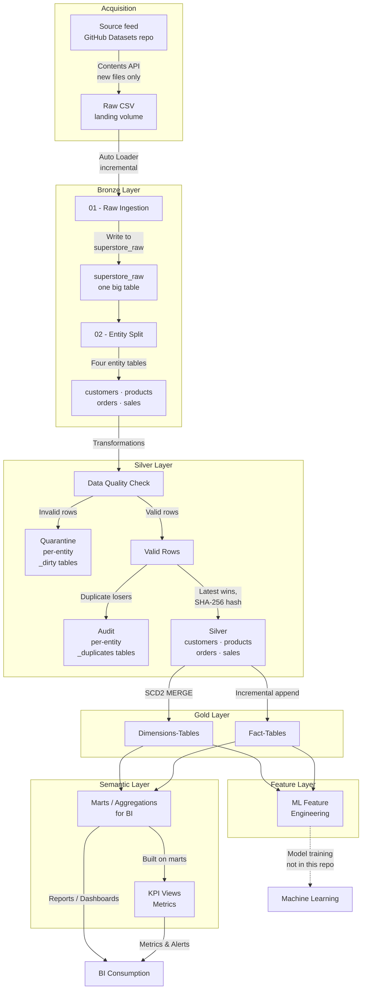
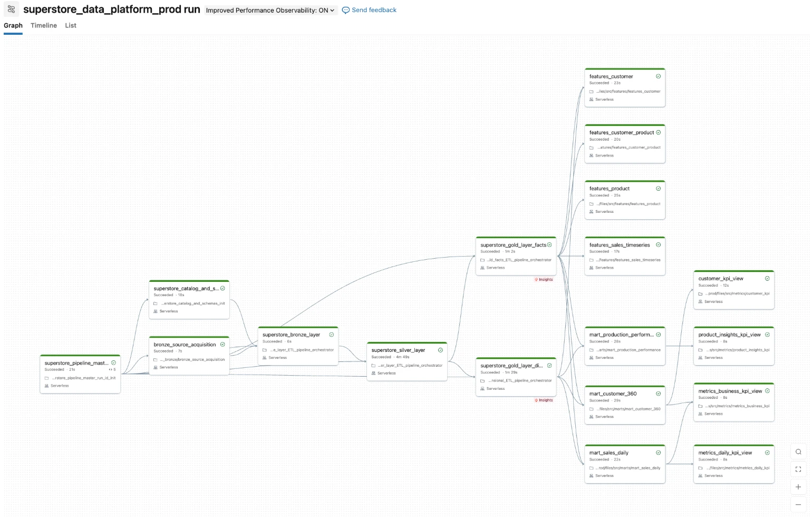

# Superstore Data Platform

An end-to-end **lakehouse data platform** on Databricks Serverless: Medallion Architecture (Bronze → Silver → Gold) with SCD2 dimensions, data-quality quarantine routing, **real unit + integration tests**, and a fully automated CI/CD pipeline (GitHub Actions + Databricks Asset Bundles) promoting code through dev → qa → prod.

**What makes this project different from most portfolio pipelines:**

- **Tested like production software** — 277 unit tests against extracted pure functions, plus an end-to-end integration test that seeds dirty data, runs the *real* 18-task pipeline in an isolated environment, asserts every layer, verifies SCD2 change detection across two loads, replays the window twice to prove re-derivation is idempotent, and always cleans up.
- **Git is the single source of truth** — every notebook, module, and YAML config is deployed by the bundle (`${workspace.file_path}` paths + runtime-derived `BUNDLE_ROOT`); nothing is hand-synced to the workspace.
- **Data quality as routing, not filtering** — invalid rows are quarantined with named rule violations (`error_columns`), descriptive violations are repaired and flagged rather than discarding the row ([docs/SEVERITY_TIERS.md](docs/SEVERITY_TIERS.md)), duplicates are audited, and a reconciliation invariant accounts for every row: `bronze == silver + quarantine + audit + superseded`, where the fourth term is derived from Bronze rather than stored ([docs/RECONCILIATION_INVARIANT.md](docs/RECONCILIATION_INVARIANT.md)). The three-term form holds only after a full re-derivation — under incremental loading a MERGE that updates a row in place leaves the superseded version in no bucket.

---

## Architecture





*The `superstore_data_platform_prod` job: 18 tasks from HTTP source acquisition through
Bronze → Silver → Gold to marts, features and KPI views. The same DAG runs in dev, qa and
prod; only `SUPERSTORE_ENV` differs.*

*Screenshot captured 2026-08-02, and worth being precise about what it shows: the DAG
shape, not a productive run. Prod had no source file until 2026-08-16, so every green run
before that date — including this one — ran 18 tasks over an empty landing volume and
produced nothing. That is the defect described in
[Defects found by measurement](#defects-found-by-measurement-not-by-failure), and it is
left visible here rather than swapped for a flattering screenshot. The first prod run to
carry real data completed **2026-08-16 in 5.6 min**: 18/18 tasks, 92 source rows, four
Silver entities at `run_status = 'SUCCESS'`, reconciliation balanced on all four, zero
orphaned facts.*

### Layers

| Layer | Modules | What it does |
|---|---|---|
| **Acquisition** | `bronze_source_acquisition` | Pulls new source files from an external HTTP feed (GitHub Contents API) into the environment's landing volume, standing in for a vendor drop. Idempotent by construction — downloads the set difference between the source listing and what has already landed, so re-runs land nothing. Distinguishes "no *new* files" (healthy) from "no files *at all*, and nothing ever landed" (fatal), because the latter used to exit cleanly and let a run that could not produce data report SUCCESS. Each env reads its own source folder; `integration_test` has no source configured and skips, since its data comes from the seed |
| **Bronze** | `bronze_ingest_superstore_module_01`, `bronze_entity_superstore_module_02` | Auto Loader (`cloudFiles`) incremental CSV ingest into a one-big-table `superstore_raw` with metadata enrichment (source file, ingestion ts), then splits into entity tables (customers, products, orders, sales) preserving row counts and provenance |
| **Silver** | `superstore_silver_module` + `superstore_silver_transformations` (pure functions) | Cleansing, conforming known source dialects to the canonical vocabulary *before* validating them ([docs/VALUE_STANDARDIZATION.md](docs/VALUE_STANDARDIZATION.md)), null-business-key / regex / categorical / business-rule validation with **quarantine routing**, latest-wins deduplication with **audit trail**, SHA-256 row hashing, Delta MERGE upserts |
| **Gold** | `superstore_gold_dimension_framework`, `superstore_gold_facts_framework` | Config-driven **SCD2 dimensions** (one current row per key, closed non-overlapping validity ranges dated in processing time — [docs/SCD2_VALIDITY_DATING.md](docs/SCD2_VALIDITY_DATING.md)) and incremental fact tables keyed on natural keys. Facts are **not** referentially enforced against dimensions — see [docs/REFERENTIAL_COMPLETENESS.md](docs/REFERENTIAL_COMPLETENESS.md) |
| **Serving** | marts / features / metrics notebooks | Customer 360, sales daily, product performance marts; ML feature tables; business KPI views |

### Cross-cutting design

- **Config-driven** — column contracts, DQ rules, and env-specific paths live in YAML (`configs/`), not code. Adding a rule or entity is a config change.
- **Environment isolation** — `SUPERSTORE_ENV` (dev/qa/prod/integration_test) resolves schemas (`{env}_bronze`, …) and volume paths per environment via a single job parameter.
- **Idempotency, backfill & replay** — hash-based change detection, Auto Loader checkpoints, and four job parameters (`run_mode`: incremental / backfill / replay / full_refresh, plus `start_date`/`end_date` and `dry_run`). Backfill re-acquires from source; replay skips Bronze and re-derives Silver and Gold from the data already held; `dry_run` is honoured by every task that writes. Re-deriving is idempotent at every layer that holds derived data: Silver and Gold through their merge keys, quarantine and audit through a delete scoped to exactly the window a run re-reads — they were previously appended to, so each replay added a second copy of every dirty row and the reconciliation invariant over-counted (**[docs/RUN_MODE_IDEMPOTENCY.md](docs/RUN_MODE_IDEMPOTENCY.md)**). The window itself now means one thing at every layer — Gold dimensions selected on Silver write time rather than Bronze ingestion time, which made replay silently select nothing (**[docs/GOLD_WINDOW_ALIGNMENT.md](docs/GOLD_WINDOW_ALIGNMENT.md)**). Operator procedures: **[docs/BACKFILL_QUICK_REFERENCE.md](docs/BACKFILL_QUICK_REFERENCE.md)**.
- **Observability** — structured logging (`superstore_logger`) with `master_run_id`/`layer_run_id` traceability, per-entity metrics tables per layer, and email notifications on job failure. Data-quality monitors are *routed*, not merely logged: an unbalanced reconciliation or a non-zero orphaned-fact count is routed by `superstore_alerting` to an optional Slack webhook — **a design later shown to be the wrong one**, and never verified, because no webhook has ever been configured. The freshness SLA below is the pattern that replaced it: a Databricks SQL Alert declared as a bundle resource, with its own schedule and managed delivery, verified firing end to end. Conditions that are normal — a positive `superseded` count, placeholder rows — are deliberately not alertable, because a permanently red channel is a muted one. What each alert means and what to do about it: **[docs/ALERT_RESPONSE.md](docs/ALERT_RESPONSE.md)**.
- **Reconciliation, and where it stops** — `bronze == silver + quarantine + audit + superseded` proves every row is accounted for at Silver in every run mode. The fourth term is computed from Bronze, not stored, because Bronze already retains every arrival and materialising it would have duplicated 921,915 rows in dev alone; the three-term form holds only after a full re-derivation ([docs/RECONCILIATION_INVARIANT.md](docs/RECONCILIATION_INVARIANT.md)). It proves rows are **accounted for**, which is not the same as proving they **should exist**: when a backfill duplicated 505 Bronze rows that had never arrived twice, the invariant balanced perfectly — the duplicates lost Silver's dedup and were correctly counted in the audit term. It does **not** by itself prove a row is usable downstream either — a dimension absent from Gold contributes nothing to the marts while every upstream check passes, which is how 49,539 fact rows went missing from product reporting. Severity tiers closed that path (a descriptive violation no longer removes the row) and the orphan counters in the marts now read 0 structurally, so **[docs/SEVERITY_TIERS.md](docs/SEVERITY_TIERS.md)** replaced them with a placeholder-exposure metric — a monitor that goes blind when the failure it watches becomes impossible is worse than none. Mechanism, measurements and the rejected fixes: **[docs/REFERENTIAL_COMPLETENESS.md](docs/REFERENTIAL_COMPLETENESS.md)**.

### Performance

Validated end-to-end at **3M source rows**. The per-entity metrics tables make the pipeline
self-profiling — they were used to find and fix a Silver bottleneck that **halved total runtime**:

| Source rows | Before | After |
|---|---|---|
| 1,000,000 | 12 min 00 s | 8 min 32 s |
| 3,000,000 | 23 min 53 s | **11 min 38 s** |

The cause was a 7-format `coalesce(try_to_date(...))` where the actual source format sat second,
so every row paid for a failed parse first — 803 s → 158 s for the affected entity after
reordering. Full write-up, including the measurement method and a deliberately deferred
optimization: **[docs/PERFORMANCE_INVESTIGATION.md](docs/PERFORMANCE_INVESTIGATION.md)**.

A follow-up pass addressed the reason that fix over-delivered: because Databricks Serverless
forbids `cache()`/`persist()`, every Spark action replayed the whole Silver lineage, and the
layer was triggering eleven of them per entity just to collect metrics. Collapsing those into
two fused aggregations removed eight full-lineage scans per entity with no metric lost —
verified numerically equivalent, runtime impact not yet measured:
**[docs/SILVER_ACTION_COLLAPSE.md](docs/SILVER_ACTION_COLLAPSE.md)**.

Runtime is now ~60% serverless task startup and ~40% data processing at 3M rows, scaling
linearly — so task consolidation, not Spark tuning, is the next meaningful lever.

---

## Testing

### Unit tests (`tests/unit/`) — fast, local, no cluster

Production logic is extracted into **pure functions** ("functional core, imperative shell") so the exact code that runs in production is testable on a local Spark session in seconds:

```bash
pip install -r tests/unit/requirements-unit.txt
pytest tests/unit/ -v
```

Organized by layer (`bronze/`, `silver/`, `gold/`, `shared/`): dedup semantics, DQ rule routing, hash integrity, SCD2 timeline construction, fact column preparation, backfill config parsing. CI blocks every deploy on these.

### Integration test (`tests/integration_databricks/`) — the real pipeline, end to end

A Databricks job (`superstore_integration_test`) that validates the platform the way production would fail:

```
seed dirty data → run REAL pipeline (SUPERSTORE_ENV=integration_test)
  → assert_bronze   (lossless ingest, renames, entity contracts, provenance)
  → assert_silver   (quarantine caught the RIGHT rows, reconciliation, dedup, hashing)
  → assert_gold_dim (SCD2 invariants: one current row, no overlapping ranges)
  → assert_gold_fact (grain uniqueness, referential integrity)
→ seed changed data → run pipeline AGAIN
  → assert_scd2_change (change historized, unchanged rows NOT churned — idempotency)
→ cleanup (always runs, even on failure)
```

Everything runs against isolated `integration_test_*` schemas and a dedicated volume — dev/qa/prod data is never touched. A failed assertion fails the job, which fails CI.


*The `superstore_integration_test` job: the real pipeline run twice (initial load, then an SCD2 change), asserting every layer in between and always cleaning up — end to end in ~22 min on serverless.*

```bash
databricks bundle run superstore_integration_test --target qa
```

---

## CI/CD

```
push to dev  ──► unit tests ──► deploy to dev
push to qa   ──► unit tests ──► deploy to qa ──► integration test (auto)
push to main ──► unit tests ──► deploy to prod (approval gate declared, NOT enforced)
```

- **Branch strategy:** `dev` → `qa` → `main`, each branch mapped to a bundle target.
- **Gates:** unit tests block all deploys; the integration test auto-triggers after a successful qa deploy (`workflow_run`).
- **The prod approval gate does not currently stop anything.** [deploy.yml](.github/workflows/deploy.yml) declares `environment: name: production`, which is the right mechanism — but a GitHub environment only blocks when **required reviewers are added in repository settings**, and they never were. Measured 2026-08-16: two pushes to `main` deployed to prod in **80 and 120 seconds**, unattended, with no approval prompt. The `url:` beside it is still the template placeholder. Recorded here rather than quietly fixed because a safety control that is declared but inert is more dangerous than one that is absent — the YAML reads as protected to anyone reviewing it, including its author.
- **Deploys** use Databricks Asset Bundles (`databricks bundle deploy --target <env>`) with Terraform pinned in CI for reproducibility.
- **Schedule:** prod runs weekly, Sundays 06:00 Sydney. `dev` and `qa` share the same job definition but are `mode: development`, and Databricks Asset Bundles pause schedules automatically in development mode — so `pause_status` is deliberately left unset in the job YAML. Setting it explicitly overrides that preset and schedules every environment, which is what happened on the first attempt and was caught only by reading the deployed job back from the API. Weekly rather than daily because the source is a static dataset: a run mostly pays 18 serverless task startups to ingest nothing.

- **Governance is a separate lifecycle.** Unity Catalog grants are Terraform, planned and tested on a pull request and applied by hand — not a task in the pipeline, and not on the pipeline's schedule. There is deliberately no apply job: the account groups do not exist yet, so an automated apply would fail on an unknown principal every time, and a permanently red workflow is one people stop reading. Permissions change a few times a year; data moves every day, and giving them one clock would mean the identity that runs pipeline code also holds the power to grant access. See **[docs/UNITY_CATALOG_GRANTS.md](docs/UNITY_CATALOG_GRANTS.md)**.

Workflows: [.github/workflows/deploy.yml](.github/workflows/deploy.yml), [unit-tests.yml](.github/workflows/unit-tests.yml), [integration-tests.yml](.github/workflows/integration-tests.yml), [governance.yml](.github/workflows/governance.yml)

---

## Repository structure

```
databricks.yml                     # bundle: targets (dev/qa/prod), variables
resources/
  superstore_lakehouse_job.job.yml # 18-task pipeline DAG + parameters + notifications
  integration_test_job.job.yml     # seed → pipeline → asserts → cleanup
configs/                           # YAML: column contracts, DQ rules, env paths
src/
  superstore_bronze/               # ingestion + entity split modules
  superstore_silver/               # DQ/dedup module + pure transformation functions
  superstore_gold/core/            # SCD2 dimension + facts frameworks
  superstore_shared_utilities/     # logger, platform config, backfill utils, run-id init
  dashboards/                      # executive, customer, product dashboards
  features/ | marts/ | metrics/    # serving-layer notebooks
superstore_orchestrator/
  layer_orchestrator/              # per-layer orchestration notebooks
terraform/
  governance/                      # Unity Catalog permission model (separate lifecycle)
tests/
  unit/                            # pytest suite (local Spark), by layer
  integration_databricks/          # seed / per-layer asserts / cleanup notebooks
.github/workflows/                 # CI/CD
```

---

## Getting started

**Prerequisites:** a Databricks workspace (serverless), Databricks CLI ≥ 0.229 (`curl -fsSL https://raw.githubusercontent.com/databricks/setup-cli/main/install.sh | sh`), Python 3.12.

```bash
git clone https://github.com/111BM/superstore_data_platform.git
cd superstore_data_platform

# validate + deploy to dev
databricks bundle validate --target dev
databricks bundle deploy --target dev

# run the pipeline
databricks bundle run superstore_data_platform --target dev

# run tests
pytest tests/unit/ -v                                              # local, seconds
databricks bundle run superstore_integration_test --target qa     # cluster, ~25 min
```

For CI/CD: set `DATABRICKS_HOST` and `DATABRICKS_TOKEN` as GitHub Actions secrets; pushes to dev/qa/main handle the rest.

---

## Defects found by measurement, not by failure

Every defect below passed its tests, ran green, and produced a wrong result quietly. None raised, none logged an error, none failed a build. They were found by measuring what the pipeline produced and comparing it against what it claimed — the only method that works on this class of bug.

Most shared one shape: **invalid input accepted and quietly reinterpreted rather than rejected.** A hyphenated job parameter silently ignored; `dry_run` honoured by one layer of seven while the DAG reported success; an unrecognised `run_mode` degraded to `incremental`; an unrecognised log level degraded to `INFO`, so roughly half the pipeline's warnings were recorded as INFO; a bare `OFF` in YAML parsed as the boolean `false`, so a category mapping loaded, deployed and matched nothing. Each failed *successfully*. Where they are fixed, the code raises or warns instead of guessing.

The rest were **operations that did nothing and reported success** — a harder shape, because there is no invalid input to reject and every count still looks plausible.

| What was wrong | How it presented | Write-up |
|---|---|---|
| Silver dedup ordered on a partial key, so tied rows were resolved by shuffle order | same input, different Silver contents on a re-run | resolved item below |
| Every DQ violation was fatal, so one bad attribute removed a customer and all their revenue from reporting | 49,539 fact rows absent from product reports, every upstream check green | **[SEVERITY_TIERS.md](docs/SEVERITY_TIERS.md)** |
| Category codes (`OFF`) validated against labels (`Office Supplies`) | 50,264 products quarantined on a vocabulary mismatch | **[VALUE_STANDARDIZATION.md](docs/VALUE_STANDARDIZATION.md)** |
| Quarantine and audit were appended to while Silver merged | every replay added a second copy of each dirty row; the invariant over-counted | **[RUN_MODE_IDEMPOTENCY.md](docs/RUN_MODE_IDEMPOTENCY.md)** |
| Gold dimensions windowed on Silver write time, Silver on Bronze ingestion time | replay selected **zero** dimension rows and reported success | **[GOLD_WINDOW_ALIGNMENT.md](docs/GOLD_WINDOW_ALIGNMENT.md)** |
| `bronze == silver + quarantine + audit` never held under incremental loading | 416 rows short on customers at 1M rows, unnoticed | **[RECONCILIATION_INVARIANT.md](docs/RECONCILIATION_INVARIANT.md)** |
| `bronze_to_silver_prod` caught every exception without re-raising | **all four Silver entities failed and the job reported SUCCESS** | — |
| An empty source folder exited via `dbutils.notebook.exit`, which **succeeds** | prod reported SUCCESS four times across three weeks with every schema empty and not one file ever landed | resolved item below |
| The freshness alert's aggregate returned one **NULL** row, and `NULL > 216` is not TRUE | the monitor built to catch silence **reported OK** on a pipeline that had never once succeeded | **[FRESHNESS_ALERT.md](docs/FRESHNESS_ALERT.md)** |
| An assertion notebook put its checks in the same cell as a `# MAGIC %md` heading, which makes the whole cell markdown | all 11 assertions were **rendered, not run**; the task exited `ASSERTIONS_OK` having verified nothing | **[SCHEMA_DRIFT.md](docs/SCHEMA_DRIFT.md)** |
| The same notebook resolved table names via `get_env()`, which is `os.getenv("SUPERSTORE_ENV", "dev")` | three CI runs measured **dev** while reporting confidently about the integration suite — including one presented as proof a detector worked | **[SCHEMA_DRIFT.md](docs/SCHEMA_DRIFT.md)** |
| A backfill used a fresh per-window Auto Loader checkpoint, so every in-window file looked new | an already-ingested file was appended a second time — 505 rows became 1,010, the run reported SUCCESS, and the reconciliation invariant **still balanced** | resolved item below |

The last is the reason the others could hide, and the only one verified by deliberately breaking the pipeline: a nonexistent column injected into the products config now fails the Silver task and skips all 13 downstream tasks, where before it went green.

Four habits came out of this, all of which cost real time to learn:

- **A green run is not evidence.** Every result here was confirmed against data counts, not job status. Four `TERMINATED/SUCCESS` prod runs sat on top of nine empty schemas for three weeks.
- **A check is only as good as the data's ability to make it fail.** Severity tiers were declared "verified in dev" while dev structurally could not produce the case that broke them; the qa integration suite caught it afterwards. The freshness alert repeated the lesson: it evaluated on schedule for days while incapable of returning a value that could breach its own threshold.
- **A test that reads the wrong thing does not fail — it reports confidently about something nobody asked.** Both defects in the last two rows above are *mine*, written while building a detector whose entire purpose was to stop exactly this. A missing table would have failed on the first run; a plausible one survived four. The guards that now exist — asserting the number of checks that actually executed, and asserting the resolved table names contain `integration_test` — are cheap, and neither would have been written without the failure.
- **A signal nothing can read is not observability.** `bronze_source_acquisition` prints whether it authenticated with a token or fell back to anonymous — and the Databricks Jobs API returns only the `dbutils.notebook.exit` string for a notebook task, never cell output. The one line distinguishing a working credential from a silently degraded one was visible solely to a human opening the run in a browser. Anything a monitor must read belongs in the exit message.

### Resolved

- **Data-quality severity tiers** — Only business keys are fatal now; a descriptive violation is recorded in `repaired_columns` and the row continues, with Gold substituting `'Unknown'` so no dimension attribute is ever null. Orphaned facts went to zero in dev (49,539 → 0 for products, 62 → 0 for customers). Deduplication had to change with it: an incomplete row could otherwise beat a complete one and overwrite a known value with a placeholder — 81 of 99 cases before the fix, 0 after. Placeholder exposure is now monitored per run from both marts — the orphan counters they sit beside read 0 permanently once tiers land, so they went blind exactly when the failure changed shape. On the real 793 customers and 1,862 products this recovers nothing — every genuine record is already complete — so it is preparation for an incomplete source, not a repair. See **[docs/SEVERITY_TIERS.md](docs/SEVERITY_TIERS.md)** and **[docs/REFERENTIAL_COMPLETENESS.md](docs/REFERENTIAL_COMPLETENESS.md)**.

- **Deduplication determinism** — Silver dedup was latest-arrival-wins on `bronze_ingestion_ts` alone. Duplicates within a single batch share that timestamp, so the ordering window tied and the survivor was decided by shuffle order: the same input could produce different Silver contents on a re-run. The window now orders on three keys — **fewest repaired attributes**, then `bronze_ingestion_ts` descending, then a SHA-256 content hash — which totally orders any two rows that differ at all, so the survivor is a function of the data rather than of the execution. The first key was added with severity tiers: an incomplete row could otherwise beat a complete observation of the same entity and Gold would substitute `'Unknown'` over a value present in the same batch (81 of 99 cases in dev). Both are verified by tests that fail against the old window and pass against the new one. **What this does not fix:** the hash carries no business meaning, so it makes the choice reproducible, not correct. Choosing the genuinely-latest version needs a change timestamp no entity carries — `order_date` is an attribute of the order, not a version marker, so two versions of one order hold the same value. With a CDC source this becomes ordering by commit time and both tiebreaks drop out. See **[docs/SEVERITY_TIERS.md](docs/SEVERITY_TIERS.md)**.

- **Reconciliation under incremental loading** — The invariant now carries a fourth, derived term: `bronze == silver + quarantine + audit + superseded`. Silver holds one row per key and Bronze one per arrival, and deduplication only ranks rows within the batch it is given — so a key arriving again in a *later* run is merged over the top and its superseded version lands in no bucket. Measured at 7 of 9 in the integration test and 416/413 short in dev at ~1M rows. The fourth term is computed from Bronze rather than stored, because Bronze already retains every arrival and materialising it via Change Data Feed would have written 921,915 duplicate rows in dev alone. Verified where it returns a **non-zero** answer, not only where it returns zero — the integration test asserts `superseded` equals the independently observed shortfall and, on customers, exactly 2. See **[docs/RECONCILIATION_INVARIANT.md](docs/RECONCILIATION_INVARIANT.md)**.

- **The integration suite stopped paying for orchestration it does not assert on** — measured on a green run, not estimated: 4 pipeline invocations, **88 task startups, 41.9 of 56.2 minutes** — to process a **nine row** seed. Almost none of that was computation; it was serverless task startup, which the performance section already measures at ~60% of runtime at 3M rows and which approaches 100% at this size. A replay re-derives Silver and Gold from Bronze already held — Bronze exits immediately, and `assert_replay` inspects Bronze, Silver, Gold, quarantine, audit and metrics, never marts, features or KPI views. Each replay was running eleven tasks nothing looked at, twice per suite. The replay legs now call the three **production** layer orchestrators a replay actually touches, cutting `run_job_task` invocations from 4 to 2 and task startups from 88 to **57**. **What this gives up:** those legs are now a hand-maintained subset of the pipeline's internal wiring, so a layer added later would not be run by them. That is why the initial and incremental loads are deliberately left as full invocations — they prove the *real* invocation path works, and the replays merely re-run the same code on the same data with a different `run_mode`. The drift guard already existed: `assert_replay` requires a `REPLAY` `load_type` row in **both** `silver_layer_metrics` and `gold_layer_metrics`, so dropping a layer fails the suite rather than quietly narrowing it. It does **not** catch a layer being *added* — that residual risk is documented, not automated. **Why it was deferred and what changed:** the cost is invisible on a weekly promotion, and highly visible while debugging — five or six suite cycles in one session, each ~56 minutes to confirm a single fact. See **[docs/INTEGRATION_TEST_GRANULARITY.md](docs/INTEGRATION_TEST_GRANULARITY.md)**.

- **A backfill no longer re-ingests what Bronze already holds** — `backfill` sets `includeExistingFiles=True` and uses a **per-window** Auto Loader checkpoint (`_backfill_YYYYMMDD_YYYYMMDD`) so it cannot disturb the incremental checkpoint the scheduled runs depend on. That is correct, and it also guarantees Auto Loader has no memory of any file in the window — so every in-window file looks new, and the Bronze write is a plain `append` with no deduplication. Measured in dev on 2026-08-20: a backfill over a single day took `Superstore_12-02-2026.csv` from **505 rows to 1,010**, an exact duplicate of a file that had landed weeks earlier, and the run reported SUCCESS. **The most useful part of this defect is how thoroughly it hid.** `bronze_ingestion_ts` is re-stamped on re-read, so the duplicates are not identical rows: Silver's latest-arrival-wins dedup keeps one, the loser goes to the audit table, and **the reconciliation invariant still balances perfectly** — `bronze == silver + quarantine + audit + superseded` holds, because the phantom rows genuinely *are* accounted for. The strongest correctness check in this platform proves rows are accounted for, not that they *should exist*. The agreed semantics are now enforced: a backfill fetches what is **missing** in a window; reloading a window is what `full_refresh` is for. Files are excluded on `source_file_name` **and** `source_file_modification_time`, never name alone — a vendor re-exporting the same filename with new content is a real event, and skipping it would drop genuine data, the opposite failure and a worse one. `classify_backfill_scope` also separates `NOTHING_MISSING` (healthy — the gap is already filled) from `WINDOW_MATCHED_NOTHING` (a date range that never had data, which is a typo far more often than a fact); both previously ingested zero rows and reported success identically. Verified by re-running the **identical** backfill after the fix: `delta=+0`.

- **Schema-drift detection and column contracts** — a new source column used to vanish without trace: Auto Loader adds it to `superstore_raw`, and the entity split then selects a hardcoded YAML allowlist, so the column never leaves Bronze. The allowlist is **correct** — a human deciding what enters the model is the point, and this work deliberately did not change it. What was wrong is that the decision happened *by silence*. `col__rescued_data` had the same problem one level down: present on the table, populated by Auto Loader, and `grep -rn "rescued"` across the repo returned nothing. Every source column is now in exactly one of three states — **declared** (carried downstream), **ignored** (knowingly dropped, reason recorded in `ignored_source_columns`), or **drift** (nobody has decided) — and drift is written to `{env}_metrics.schema_drift` with a first-seen timestamp. The third state exists because running the two-state version against the real config immediately reported `row_id`: present in every file, declared by no entity, dropped on every run since the platform was built. A true positive *and* a deliberate decision, which is the cry-wolf case, so the fix was to record the decision rather than widen the filter. A declared column that stops arriving now raises where the cause is known, naming the column and its owning entities, instead of surfacing as `AnalysisException: cannot resolve segment` from inside the split — verified in dev by declaring a column that does not exist. A **retyped** column turned out not to be schema drift at all: every source column is read as `STRING`, so nothing can fail to parse at Bronze, and type validation is Silver's regex rules, which quarantine `Sales = "not-a-number"` on every CI run. **What this does not fix:** it makes drift *visible*, not *handled* — the failed Bronze attempt on a new column is backlog item 2 above. See **[docs/SCHEMA_DRIFT.md](docs/SCHEMA_DRIFT.md)**.

- **An empty source can no longer report success** — `bronze_source_acquisition` treated "the source contains no data files" as a clean exit. `dbutils.notebook.exit` **succeeds**, so the task went green, the fourteen downstream tasks ran against an empty landing volume, and the job reported SUCCESS having processed nothing. That is why prod looked healthy while being empty: its source folder held only a README, so the prod landing volume had never contained a file and `prod_bronze` / `prod_silver` / `prod_metrics` were all empty — while four prod runs in July 2026 reported `TERMINATED/SUCCESS`. The old code conflated two different events: *no NEW files* is what an idempotent weekly pipeline looks like on a quiet week and is already handled by the set difference; *no files at all, and nothing ever landed* means the run cannot produce anything. The landing volume separates them, so it is now inspected before the check rather than after: source has files → proceed; source empty but landing populated → warn and continue on what is held; both empty → **raise**. Keyed on data rather than on target deliberately — "fail in prod, tolerate elsewhere" needs an environment allowlist, the same construct that silently dropped `value_standardization` and then `severity` from the Silver config. **What this did not fix:** it makes prod stop *reporting* that it works; it does not make prod work. That took a source file, added 2026-08-16, after which prod produced real tables for the first time.

- **Unity Catalog grants** — a per-layer permission model now exists, declared in **[terraform/governance/model.tf](terraform/governance/model.tf)** and applied with Terraform: analysts and data scientists reach `gold`, `mart` and `semantic_layer`; `bronze`, `silver`, `quarantine` and `audit` stay engineer-only, because all four hold row-level customer names and addresses. Every privilege is granted on a **schema**, never a table — the layer already *is* the schema here, so tables that do not exist yet inherit the right access and a new Gold fact needs no governance change. The rule the model rests on: no data privilege is ever granted on the catalog, because `dev`, `qa` and `prod` are schemas inside one, so a single `GRANT SELECT ON CATALOG` would expose every layer of every environment at once. Three `precondition` blocks fail the plan if that rule, or the `SELECT`-implies-`USE_SCHEMA` pairing, or the consumer/raw-layer separation is ever broken. **Deliberately not a pipeline task** — the first design put it in the ETL DAG, which would have required the pipeline identity to hold `MANAGE`, making a merge to this repo sufficient to grant yourself `prod_quarantine`. **Unverified against real principals:** the account groups it grants to do not exist in this workspace and creating them needs account-admin rights, so no apply has succeeded — what is verified is that the config validates against the provider schema, that all three preconditions return `true` on the model and `false` on deliberately broken variants, and that `terraform test` passes 7 runs against a mocked provider — no workspace, no credentials. The suite exists because the preconditions only catch **over**-sharing: a model that grants nobody anything satisfies all three of them, so the tests assert the other direction too, and were themselves checked by breaking the model on purpose and confirming the right run goes red. See **[docs/UNITY_CATALOG_GRANTS.md](docs/UNITY_CATALOG_GRANTS.md)**.

- **Alert routing — built, unverified, and the wrong shape.** The three data-quality monitors (orphaned facts, placeholder exposure, reconciliation balance) wrote only to driver logs, which is how a 5%-of-revenue orphan problem stayed hidden: correctly counted, correctly logged, unread. `superstore_alerting` routes the two conditions that are genuinely wrong — an unbalanced reconciliation, and orphaned facts, which are structurally 0 since severity tiers so any non-zero count means a new cause — to an optional Slack webhook. Deliberately not wired to `superseded > 0` or placeholder rows, both of which are normal: alerting on normal produces a permanently red channel, and a permanently red channel is a muted one. An unconfigured webhook logs `NOT ROUTED` at WARN rather than returning quietly, so an unrouted workspace cannot be mistaken for a healthy one.

  **The honest status is not "done".** No webhook has ever been configured, so not one alert has been delivered by this path. And the reasoning that produced it was wrong: it was built because SQL Alerts were assumed to be UI-configured workspace state, contradicting *"Git is the single source of truth"*. Checking `databricks bundle schema` first would have shown `alerts` is a bundle resource — versioned, reviewed, promoted dev → qa → prod like any job, with its own schedule and managed delivery, and none of the payload builder, webhook secret and sixteen unit tests this module carries. The freshness SLA below is that pattern, and it is verified firing end to end. A module that works but should not exist is kept here, described accurately, rather than deleted to make the history tidier.

- **Operational runbook** — four run modes (`incremental` / `backfill` / `replay` / `full_refresh`) plus a pipeline-wide `dry_run` are documented for operators in **[docs/BACKFILL_QUICK_REFERENCE.md](docs/BACKFILL_QUICK_REFERENCE.md)**: how to choose a mode, copy-paste commands, a pre-flight safety checklist, monitoring queries, troubleshooting, and worked scenarios. Alert response procedures are in **[docs/ALERT_RESPONSE.md](docs/ALERT_RESPONSE.md)**: what each alert means, what it explicitly does *not* mean, the first query to run, likely causes ranked, and remediation. **Escalation tiers and a rota are deliberately omitted** — this platform has one operator, and a page-the-secondary policy would be a fabricated artifact. What survives that omission is the half that gets used even in large teams.

- **Freshness SLA** — A Databricks SQL Alert fires when no Silver entity has completed successfully for more than 9 days, evaluated daily at 08:00 Sydney against `silver_layer_metrics` — not the Jobs API, because a job can report SUCCESS while every entity inside it fails. It could not have lived inside the pipeline: a check that runs as a pipeline task cannot notice the pipeline *not running*, which is the one failure it exists to catch. Declared as a bundle resource, so it is versioned and promoted like any job. Active in prod only, since freshness presupposes a cadence and only prod is scheduled.

  **It shipped unable to detect the thing it was built for.** An aggregate with no `GROUP BY` returns exactly one row however many the filter matches, so with no successful run the query returned a single `NULL` — and `NULL > 216` evaluates to NULL, which is not TRUE. The alert reported **OK** against a pipeline that had never once succeeded. `empty_result_state: TRIGGERED` did not cover it (that is zero *rows*, which this query cannot return) and neither did it cover a missing table (that is a query *error*, which surfaces as state `ERROR`). The documentation asserted all three cases were handled, and that assertion is precisely why nobody checked. Fixed with `COALESCE(..., 999999)`, a sentinel no real elapsed time reaches.

  **Verified on real evaluations, every path** — the only claim in this README that can say so: `ERROR` → email (prod, missing metrics table), `TRIGGERED` → email (threshold lowered against dev, fired in 3 min), `OK` → recovery email via `notify_on_ok`, and the NULL sentinel returning `999999` against a no-match filter. Restored to its original configuration afterwards, field by field against a backup. **Data** freshness remains out of scope and always will be here — the source is a static dataset, so a recency check on the data would be permanently red. See **[docs/FRESHNESS_ALERT.md](docs/FRESHNESS_ALERT.md)**.

---

## Productionizing backlog

Gaps I'm aware of and would close before running this at real scale — kept here deliberately, because knowing them is part of the engineering. Items resolved during development are recorded above rather than deleted.

1. **Service principal for CI** — deploys currently authenticate with a personal access token; production should use an OAuth M2M service principal.

2. **A new source column costs a failed Bronze attempt** — and the original wording of this item was wrong, which is worth keeping visible. It read *"Auto Loader handles new columns (`addNewColumns`); downstream silver/gold contracts need an explicit evolution strategy"*. The downstream half is done and is in Resolved below. The upstream premise was false: Auto Loader does **not** handle new columns. It raises `UNKNOWN_FIELD_EXCEPTION`, Databricks retries the task unprompted with nothing configured, and the retry succeeds and adds the column. Measured 2026-08-17 in dev and `integration_test`. An in-pipeline restart was built to make that legible and **abandoned after two attempts**: the error reaching Python carries only `Some streams terminated before this command could finish!`, while the marker lives in Databricks' captured Java trace, unreachable from `traceback.format_exc()`. The behaviour is correct — the run recovers and `schema_drift` records the column — only the run history is untidy. Closing it properly means either catching the async stream failure some other way, or moving to `rescue` mode so Bronze never fails at all and promotion is always explicit.

3. **Environment pinning** — all 18 tasks are pinned to a single serverless environment (`superstore_serverless_environment`, version 5). The remaining gap is a policy for *when* to bump it: pinning is only useful if it is total, and a partial pin is worse than none, because it converts a visible platform upgrade into an invisible divergence between tasks in the same run.

4. **Retroactive dimension history** — a dimension change that happened in the past and arrives now is dated when the pipeline observed it, not when it occurred. Two independent blockers: the source carries no change timestamp, and Silver deduplicates to current state, so a historical version is classified as a duplicate and audited before Gold ever sees it. Closing this needs Silver to retain versions per entity — an architecture change, not a fix. See **[docs/SCD2_VALIDITY_DATING.md](docs/SCD2_VALIDITY_DATING.md)**.

5. **Catalog and schema creation lives in the ETL job** — found while building the permission model, and the same shape of problem. `superstore_catalog_and_schemas_init` runs `CREATE CATALOG` and `CREATE SCHEMA` on every pipeline run, so the pipeline identity permanently holds rights it genuinely needs once per environment, ever. That is the argument that kept grants out of the DAG, applied one level up: an identity that runs notebooks from this repo should not also be able to create securables. The route is to declare catalog and schemas as bundle resources or Terraform and let the pipeline only write tables into schemas that already exist. Not done here because it changes how every environment is bootstrapped, including `integration_test`, whose suite currently relies on the pipeline creating its schemas — a bigger change than the item that surfaced it.

**Table maintenance — not a gap, recorded as a decision.** Handled by Unity Catalog **Predictive Optimization**, which is enabled at the metastore level, so `OPTIMIZE`/`VACUUM` run automatically on these managed tables (VACUUM at the 168-hour default, so time travel beyond ~7 days is already unavailable). The `optimize_*`/`vacuum_*` helpers in the frameworks predate that and are deliberately unwired — running them per-load would duplicate PO and pay compaction cost far more often than fragmentation is created. If data skipping ever became a concern, the route is Liquid Clustering (`CLUSTER BY`) on the gold tables, not a scheduled Z-ORDER job.

The classic [Superstore retail dataset](https://www.kaggle.com/datasets/vivek468/superstore-dataset-final) (orders, customers, products, sales) — small by design so the platform patterns (not data volume) are the point. The integration test uses a synthetic 9-row seed engineered to trip every DQ rule.

Source files are served from a separate repo, [`111BM/Datasets`](https://github.com/111BM/Datasets), under one folder per environment (`dev` / `qa` / `prod`). That repo plays the role of a vendor's file drop: dropping a new CSV into a folder is all it takes for the next run to pick it up — no config change, no code change. `bronze_source_acquisition` reads the folder listing over the GitHub Contents API and downloads only files the landing volume does not already have.

## Author

**Biresh Tamang** — [github.com/111BM](https://github.com/111BM)
