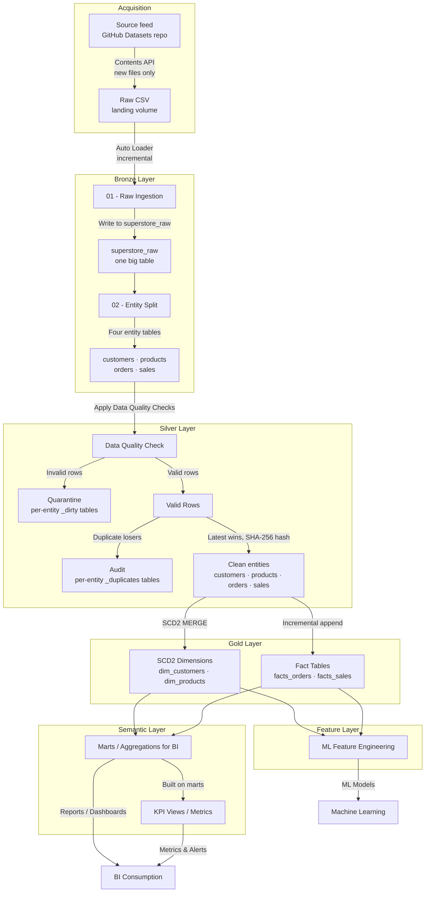
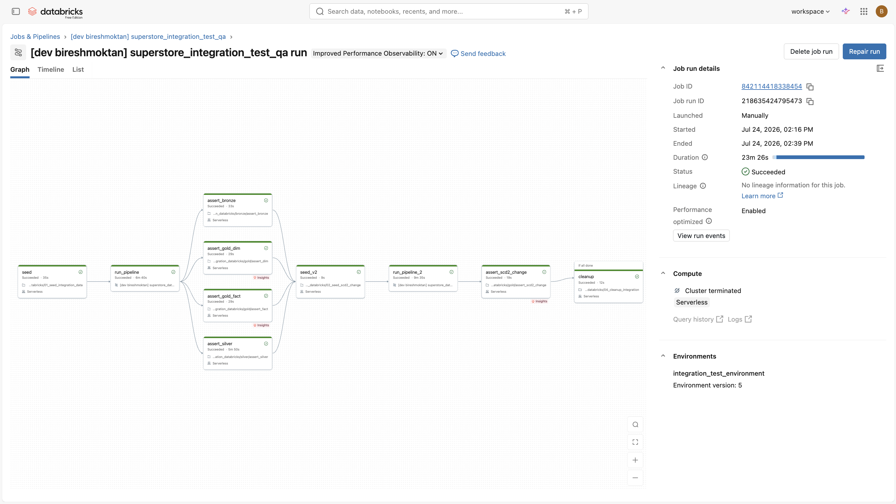

# Superstore Data Platform

An end-to-end **lakehouse data platform** on Databricks Serverless: Medallion Architecture (Bronze → Silver → Gold) with SCD2 dimensions, data-quality quarantine routing, **real unit + integration tests**, and a fully automated CI/CD pipeline (GitHub Actions + Databricks Asset Bundles) promoting code through dev → qa → prod.

**What makes this project different from most portfolio pipelines:**

- **Tested like production software** — 85+ unit tests against extracted pure functions, plus an end-to-end integration test that seeds dirty data, runs the *real* 18-task pipeline in an isolated environment, asserts every layer, verifies SCD2 change detection & idempotency across two loads, and always cleans up.
- **Git is the single source of truth** — every notebook, module, and YAML config is deployed by the bundle (`${workspace.file_path}` paths + runtime-derived `BUNDLE_ROOT`); nothing is hand-synced to the workspace.
- **Data quality as routing, not filtering** — invalid rows are quarantined with named rule violations (`error_columns`), duplicates are audited, and a reconciliation invariant guarantees `bronze == silver + quarantine + audit` (nothing silently lost).

---

## Architecture



### Layers

| Layer | Modules | What it does |
|---|---|---|
| **Acquisition** | `bronze_source_acquisition` | Pulls new source files from an external HTTP feed (GitHub Contents API) into the environment's landing volume, standing in for a vendor drop. Idempotent by construction — downloads the set difference between the source listing and what has already landed, so re-runs land nothing. Each env reads its own source folder; `integration_test` has no source configured and skips, since its data comes from the seed |
| **Bronze** | `bronze_ingest_superstore_module_01`, `bronze_entity_superstore_module_02` | Auto Loader (`cloudFiles`) incremental CSV ingest into a one-big-table `superstore_raw` with metadata enrichment (source file, ingestion ts), then splits into entity tables (customers, products, orders, sales) preserving row counts and provenance |
| **Silver** | `superstore_silver_module` + `superstore_silver_transformations` (pure functions) | Cleansing, null-business-key / regex / categorical / business-rule validation with **quarantine routing**, latest-wins deduplication with **audit trail**, SHA-256 row hashing, Delta MERGE upserts |
| **Gold** | `superstore_gold_dimension_framework`, `superstore_gold_facts_framework` | Config-driven **SCD2 dimensions** (one current row per key, closed validity ranges, no overlaps) and incremental fact tables with referential integrity to dimensions |
| **Serving** | marts / features / metrics notebooks | Customer 360, sales daily, product performance marts; ML feature tables; business KPI views |

### Cross-cutting design

- **Config-driven** — column contracts, DQ rules, and env-specific paths live in YAML (`configs/`), not code. Adding a rule or entity is a config change.
- **Environment isolation** — `SUPERSTORE_ENV` (dev/qa/prod/integration_test) resolves schemas (`{env}_bronze`, …) and volume paths per environment via a single job parameter.
- **Idempotency & backfill** — hash-based change detection, Auto Loader checkpoints, and job parameters (`backfill-mode`: incremental / date_range / full_refresh, `dry-run`) for safe replays.
- **Observability** — structured logging (`superstore_logger`) with `master_run_id`/`layer_run_id` traceability, per-entity metrics tables per layer, and email notifications on job failure.

### Performance

Validated end-to-end at **3M source rows**. The per-entity metrics tables make the pipeline
self-profiling — they were used to find and fix a Silver bottleneck that **halved total runtime**:

| Source rows | Before | After |
|---|---|---|
| 1,000,000 | 12 min 00 s | 8 min 32 s |
| 3,000,000 | 23 min 53 s | **11 min 38 s** |

The cause was a 7-format `coalesce(try_to_date(...))` where the actual source format sat second,
so every row paid for a failed parse first — 803 s → 158 s for the affected entity after
reordering. Full write-up, including the measurement method and a deliberately deferred
optimization: **[docs/PERFORMANCE_INVESTIGATION.md](docs/PERFORMANCE_INVESTIGATION.md)**.

A follow-up pass addressed the reason that fix over-delivered: because Databricks Serverless
forbids `cache()`/`persist()`, every Spark action replayed the whole Silver lineage, and the
layer was triggering eleven of them per entity just to collect metrics. Collapsing those into
two fused aggregations removed eight full-lineage scans per entity with no metric lost —
verified numerically equivalent, runtime impact not yet measured:
**[docs/SILVER_ACTION_COLLAPSE.md](docs/SILVER_ACTION_COLLAPSE.md)**.

Runtime is now ~60% serverless task startup and ~40% data processing at 3M rows, scaling
linearly — so task consolidation, not Spark tuning, is the next meaningful lever.

---

## Testing

### Unit tests (`tests/unit/`) — fast, local, no cluster

Production logic is extracted into **pure functions** ("functional core, imperative shell") so the exact code that runs in production is testable on a local Spark session in seconds:

```bash
pip install -r tests/unit/requirements-unit.txt
pytest tests/unit/ -v
```

Organized by layer (`bronze/`, `silver/`, `gold/`, `shared/`): dedup semantics, DQ rule routing, hash integrity, SCD2 timeline construction, fact column preparation, backfill config parsing. CI blocks every deploy on these.

### Integration test (`tests/integration_databricks/`) — the real pipeline, end to end

A Databricks job (`superstore_integration_test`) that validates the platform the way production would fail:

```
seed dirty data → run REAL pipeline (SUPERSTORE_ENV=integration_test)
  → assert_bronze   (lossless ingest, renames, entity contracts, provenance)
  → assert_silver   (quarantine caught the RIGHT rows, reconciliation, dedup, hashing)
  → assert_gold_dim (SCD2 invariants: one current row, no overlapping ranges)
  → assert_gold_fact (grain uniqueness, referential integrity)
→ seed changed data → run pipeline AGAIN
  → assert_scd2_change (change historized, unchanged rows NOT churned — idempotency)
→ cleanup (always runs, even on failure)
```

Everything runs against isolated `integration_test_*` schemas and a dedicated volume — dev/qa/prod data is never touched. A failed assertion fails the job, which fails CI.



*The `superstore_integration_test` job: the real pipeline run twice (initial load, then an SCD2 change), asserting every layer in between and always cleaning up — end to end in ~23 min on serverless.*

```bash
databricks bundle run superstore_integration_test --target qa
```

---

## CI/CD

```
push to dev  ──► unit tests ──► deploy to dev
push to qa   ──► unit tests ──► deploy to qa ──► integration test (auto)
push to main ──► unit tests ──► deploy to prod (manual approval gate)
```

- **Branch strategy:** `dev` → `qa` → `main`, each branch mapped to a bundle target.
- **Gates:** unit tests block all deploys; the integration test auto-triggers after a successful qa deploy (`workflow_run`); prod requires manual approval via a GitHub environment.
- **Deploys** use Databricks Asset Bundles (`databricks bundle deploy --target <env>`) with Terraform pinned in CI for reproducibility.

Workflows: [.github/workflows/deploy.yml](.github/workflows/deploy.yml), [unit-tests.yml](.github/workflows/unit-tests.yml), [integration-tests.yml](.github/workflows/integration-tests.yml)

---

## Repository structure

```
databricks.yml                     # bundle: targets (dev/qa/prod), variables
resources/
  superstore_lakehouse_job.job.yml # 18-task pipeline DAG + parameters + notifications
  integration_test_job.job.yml     # seed → pipeline → asserts → cleanup
configs/                           # YAML: column contracts, DQ rules, env paths
src/
  superstore_bronze/               # ingestion + entity split modules
  superstore_silver/               # DQ/dedup module + pure transformation functions
  superstore_gold/core/            # SCD2 dimension + facts frameworks
  superstore_shared_utilities/     # logger, platform config, backfill utils, run-id init
  dashboards/                      # executive, customer, product dashboards
  features/ | marts/ | metrics/    # serving-layer notebooks
superstore_orchestrator/
  layer_orchestrator/              # per-layer orchestration notebooks
tests/
  unit/                            # pytest suite (local Spark), by layer
  integration_databricks/          # seed / per-layer asserts / cleanup notebooks
.github/workflows/                 # CI/CD
```

---

## Getting started

**Prerequisites:** a Databricks workspace (serverless), Databricks CLI ≥ 0.229 (`curl -fsSL https://raw.githubusercontent.com/databricks/setup-cli/main/install.sh | sh`), Python 3.12.

```bash
git clone https://github.com/111BM/superstore_data_platform.git
cd superstore_data_platform

# validate + deploy to dev
databricks bundle validate --target dev
databricks bundle deploy --target dev

# run the pipeline
databricks bundle run superstore_data_platform --target dev

# run tests
pytest tests/unit/ -v                                              # local, seconds
databricks bundle run superstore_integration_test --target qa     # cluster, ~25 min
```

For CI/CD: set `DATABRICKS_HOST` and `DATABRICKS_TOKEN` as GitHub Actions secrets; pushes to dev/qa/main handle the rest.

---

## Productionizing backlog

Gaps I'm aware of and would close before running this at real scale — kept here deliberately, because knowing them is part of the engineering:

1. **Service principal for CI** — deploys currently authenticate with a personal access token; production should use an OAuth M2M service principal.
2. **Unity Catalog grants** — no per-layer permission model yet (e.g., analysts read gold only).
3. **Table maintenance** — no scheduled `OPTIMIZE`/`VACUUM` or retention policy (irrelevant at demo scale, required at volume).
4. **Schema-drift policy** — Auto Loader handles new columns (`addNewColumns`); downstream silver/gold contracts need an explicit evolution strategy.
5. **Consistent environment pinning** — serverless environment version is pinned on some tasks and default on others; should be one pinned version everywhere.
6. **Operational runbook** — replay/backfill procedures exist as job parameters but need documentation for operators who didn't build the system.
7. **Alert routing** — failure emails exist; a real deployment would route to Slack/PagerDuty with a freshness SLA check.

---

## Dataset

The classic [Superstore retail dataset](https://www.kaggle.com/datasets/vivek468/superstore-dataset-final) (orders, customers, products, sales) — small by design so the platform patterns (not data volume) are the point. The integration test uses a synthetic 7-row seed engineered to trip every DQ rule.

Source files are served from a separate repo, [`111BM/Datasets`](https://github.com/111BM/Datasets), under one folder per environment (`dev` / `qa` / `prod`). That repo plays the role of a vendor's file drop: dropping a new CSV into a folder is all it takes for the next run to pick it up — no config change, no code change. `bronze_source_acquisition` reads the folder listing over the GitHub Contents API and downloads only files the landing volume does not already have.

## Author

**Biresh Tamang** — [github.com/111BM](https://github.com/111BM)
