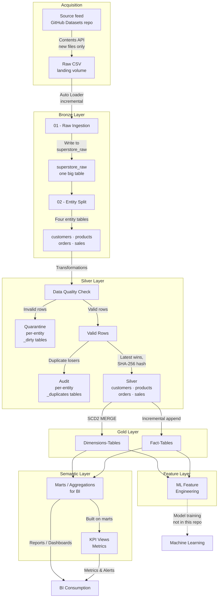

# Superstore Data Platform

An end-to-end **lakehouse data platform** on Databricks Serverless: Medallion Architecture (Bronze → Silver → Gold) with SCD2 dimensions, data-quality quarantine routing, **real unit + integration tests**, and a fully automated CI/CD pipeline (GitHub Actions + Databricks Asset Bundles) promoting code through dev → qa → prod.

**What makes this project different from most portfolio pipelines:**

- **Tested like production software** — 271 unit tests against extracted pure functions, plus an end-to-end integration test that seeds dirty data, runs the *real* 18-task pipeline in an isolated environment, asserts every layer, verifies SCD2 change detection across two loads, replays the window twice to prove re-derivation is idempotent, and resets its environment at the START rather than the end — so a run's tables survive for post-mortem whether it passed or failed.
- **Wrong data reaches a person, not just crashes** — every run records reconciliation, orphaned facts and placeholder exposure; SQL Alerts send those, schema drift, job failures and pipeline silence to email and Slack ([docs/DATA_QUALITY_ALERTS.md](docs/DATA_QUALITY_ALERTS.md)).
- **No personal credential anywhere** — prod and qa are deployed and run by their own service principals, people sign in with OAuth, and every personal access token is revoked ([docs/NON_PROD_IDENTITY.md](docs/NON_PROD_IDENTITY.md)).
- **Git is the single source of truth** — every notebook, module, and YAML config is deployed by the bundle (`${workspace.file_path}` paths + runtime-derived `BUNDLE_ROOT`); nothing is hand-synced to the workspace.
- **Data quality as routing, not filtering** — invalid rows are quarantined with named rule violations (`error_columns`), descriptive violations are repaired and flagged rather than discarding the row ([docs/SEVERITY_TIERS.md](docs/SEVERITY_TIERS.md)), duplicates are audited, and a reconciliation invariant accounts for every row: `bronze == silver + quarantine + audit + superseded`, where the fourth term is derived from Bronze rather than stored ([docs/RECONCILIATION_INVARIANT.md](docs/RECONCILIATION_INVARIANT.md)). The three-term form holds only after a full re-derivation — under incremental loading a MERGE that updates a row in place leaves the superseded version in no bucket.

---

## Architecture




*The `superstore_data_platform_prod` job: 18 tasks from HTTP source acquisition through
Bronze → Silver → Gold to marts, features and KPI views. The same DAG runs in dev, qa and
prod; only `SUPERSTORE_ENV` differs.*

*Screenshot captured 2026-08-02, and worth being precise about what it shows: the DAG
shape, not a productive run. Prod had no source file until 2026-08-16, so every green run
before that date — including this one — ran 18 tasks over an empty landing volume and
produced nothing. That is the defect described in
[Defects found by measurement](#defects-found-by-measurement-not-by-failure), and it is
left visible here rather than swapped for a flattering screenshot. The first prod run to
carry real data completed **2026-08-16 in 5.6 min**: 18/18 tasks, 92 source rows, four
Silver entities at `run_status = 'SUCCESS'`, reconciliation balanced on all four, zero
orphaned facts.*

### Layers

| Layer | Modules | What it does |
|---|---|---|
| **Acquisition** | `bronze_source_acquisition` | Pulls new source files from an external HTTP feed (GitHub Contents API) into the environment's landing volume, standing in for a vendor drop. Idempotent by construction — downloads the set difference between the source listing and what has already landed, so re-runs land nothing. Distinguishes "no *new* files" (healthy) from "no files *at all*, and nothing ever landed" (fatal), because the latter used to exit cleanly and let a run that could not produce data report SUCCESS. Each env reads its own source folder; `integration_test` has no source configured and skips, since its data comes from the seed |
| **Bronze** | `bronze_ingest_superstore_module_01`, `bronze_entity_superstore_module_02` | Auto Loader (`cloudFiles`) incremental CSV ingest into a one-big-table `superstore_raw` with metadata enrichment (source file, ingestion ts), then splits into entity tables (customers, products, orders, sales) preserving row counts and provenance |
| **Silver** | `superstore_silver_module` + `superstore_silver_transformations` (pure functions) | Cleansing, conforming known source dialects to the canonical vocabulary *before* validating them ([docs/VALUE_STANDARDIZATION.md](docs/VALUE_STANDARDIZATION.md)), null-business-key / regex / categorical / business-rule validation with **quarantine routing**, latest-wins deduplication with **audit trail**, SHA-256 row hashing, Delta MERGE upserts |
| **Gold** | `superstore_gold_dimension_framework`, `superstore_gold_facts_framework` | Config-driven **SCD2 dimensions** (one current row per key, closed non-overlapping validity ranges dated in processing time — [docs/SCD2_VALIDITY_DATING.md](docs/SCD2_VALIDITY_DATING.md)) and incremental fact tables keyed on natural keys. Facts are **not** referentially enforced against dimensions — see [docs/REFERENTIAL_COMPLETENESS.md](docs/REFERENTIAL_COMPLETENESS.md) |
| **Serving** | marts / features / metrics notebooks | Customer 360, sales daily, product performance marts; ML feature tables; business KPI views |

### Cross-cutting design

- **Config-driven** — column contracts, DQ rules, and env-specific paths live in YAML (`configs/`), not code. Adding a rule or entity is a config change.
- **Environment isolation** — `SUPERSTORE_ENV` (dev/qa/prod/integration_test) resolves schemas (`{env}_bronze`, …) and volume paths per environment via a single job parameter.
- **Idempotency, backfill & replay** — hash-based change detection, Auto Loader checkpoints, and four job parameters (`run_mode`: incremental / backfill / replay / full_refresh, plus `start_date`/`end_date` and `dry_run`). Backfill re-acquires from source; replay skips Bronze and re-derives Silver and Gold from the data already held; `dry_run` is honoured by every task that writes. Re-deriving is idempotent at every layer that holds derived data: Silver and Gold through their merge keys, quarantine and audit through a delete scoped to exactly the window a run re-reads — they were previously appended to, so each replay added a second copy of every dirty row and the reconciliation invariant over-counted (**[docs/RUN_MODE_IDEMPOTENCY.md](docs/RUN_MODE_IDEMPOTENCY.md)**). The window itself now means one thing at every layer — Gold dimensions selected on Silver write time rather than Bronze ingestion time, which made replay silently select nothing (**[docs/GOLD_WINDOW_ALIGNMENT.md](docs/GOLD_WINDOW_ALIGNMENT.md)**). Operator procedures: **[docs/BACKFILL_QUICK_REFERENCE.md](docs/BACKFILL_QUICK_REFERENCE.md)**.
- **Observability** — structured logging (`superstore_logger`) with `master_run_id`/`layer_run_id` traceability, per-entity metrics tables per layer, and job failures delivered to **email and a Slack channel** (`#superstore-data-platform-alerts`) through a Databricks notification destination — verified 2026-10-03 by a deliberately failed run. Data-quality checks are *recorded*, not merely logged: every run writes reconciliation, orphaned facts and placeholder exposure to `{env}_metrics.data_quality_checks`, and four SQL Alerts — bundle resources, like the freshness SLA below — notify email and Slack when reconciliation is unbalanced, orphans appear, the source schema drifts, or a dimension's placeholder share grows (**[docs/DATA_QUALITY_ALERTS.md](docs/DATA_QUALITY_ALERTS.md)**). Conditions that are normal at any level — a positive `superseded` count, a steady share of placeholder rows — are deliberately not alerted on, because a permanently red channel is a muted one. What each alert means and what to do about it: **[docs/ALERT_RESPONSE.md](docs/ALERT_RESPONSE.md)**.
- **Reconciliation, and where it stops** — `bronze == silver + quarantine + audit + superseded` proves every row is accounted for at Silver in every run mode. The fourth term is computed from Bronze, not stored, because Bronze already retains every arrival and materialising it would have duplicated 921,915 rows in dev alone; the three-term form holds only after a full re-derivation ([docs/RECONCILIATION_INVARIANT.md](docs/RECONCILIATION_INVARIANT.md)). It proves rows are **accounted for**, which is not the same as proving they **should exist**: when a backfill duplicated 505 Bronze rows that had never arrived twice, the invariant balanced perfectly — the duplicates lost Silver's dedup and were correctly counted in the audit term. It does **not** by itself prove a row is usable downstream either — a dimension absent from Gold contributes nothing to the marts while every upstream check passes, which is how 49,539 fact rows went missing from product reporting. Severity tiers closed that path (a descriptive violation no longer removes the row) and the orphan counters in the marts now read 0 structurally, so **[docs/SEVERITY_TIERS.md](docs/SEVERITY_TIERS.md)** replaced them with a placeholder-exposure metric — a monitor that goes blind when the failure it watches becomes impossible is worse than none. Mechanism, measurements and the rejected fixes: **[docs/REFERENTIAL_COMPLETENESS.md](docs/REFERENTIAL_COMPLETENESS.md)**.

### Performance

Validated end-to-end at **3M source rows**. The per-entity metrics tables make the pipeline
self-profiling — they were used to find and fix a Silver bottleneck that **halved total runtime**:

| Source rows | Before | After |
|---|---|---|
| 1,000,000 | 12 min 00 s | 8 min 32 s |
| 3,000,000 | 23 min 53 s | **11 min 38 s** |

The cause was a 7-format `coalesce(try_to_date(...))` where the actual source format sat second,
so every row paid for a failed parse first — 803 s → 158 s for the affected entity after
reordering. Full write-up, including the measurement method and a deliberately deferred
optimization: **[docs/PERFORMANCE_INVESTIGATION.md](docs/PERFORMANCE_INVESTIGATION.md)**.

A follow-up pass addressed the reason that fix over-delivered: because Databricks Serverless
forbids `cache()`/`persist()`, every Spark action replayed the whole Silver lineage, and the
layer was triggering eleven of them per entity just to collect metrics. Collapsing those into
two fused aggregations removed eight full-lineage scans per entity with no metric lost —
verified numerically equivalent, runtime impact not yet measured:
**[docs/SILVER_ACTION_COLLAPSE.md](docs/SILVER_ACTION_COLLAPSE.md)**.

Runtime is now ~60% serverless task startup and ~40% data processing at 3M rows, scaling
linearly — so task consolidation, not Spark tuning, is the next meaningful lever.

---

## Testing

### Unit tests (`tests/unit/`) — fast, local, no cluster

Production logic is extracted into **pure functions** ("functional core, imperative shell") so the exact code that runs in production is testable on a local Spark session in seconds:

```bash
pip install -r tests/unit/requirements-unit.txt
pytest tests/unit/ -v
```

Organized by layer (`bronze/`, `silver/`, `gold/`, `shared/`): dedup semantics, DQ rule routing, hash integrity, SCD2 timeline construction, fact column preparation, backfill config parsing. CI blocks every deploy on these.

### Integration test (`tests/integration_databricks/`) — the real pipeline, end to end

A Databricks job (`superstore_integration_test`) that validates the platform the way production would fail:

```
seed dirty data → run REAL pipeline (SUPERSTORE_ENV=integration_test)
  → assert_bronze   (lossless ingest, renames, entity contracts, provenance)
  → assert_silver   (quarantine caught the RIGHT rows, reconciliation, dedup, hashing)
  → assert_gold_dim (SCD2 invariants: one current row, no overlapping ranges)
  → assert_gold_fact (grain uniqueness, referential integrity)
→ seed changed data (incl. a NEW source column) → run pipeline AGAIN
  → assert_scd2_change   (change historized, unchanged rows NOT churned — idempotency)
  → assert_schema_drift  (the new column is detected and recorded)
→ replay the window twice (Silver + Gold only)
  → assert_replay        (re-derivation is idempotent: replay == replay)
(every Silver run also reconciles and records the result to data_quality_checks)
(no end-of-run cleanup — the environment is reset at the START, so a
 failed OR passing run leaves its tables available for post-mortem)
```

Everything runs against isolated `integration_test_*` schemas and a dedicated volume — dev/qa/prod data is never touched. A failed assertion fails the job, which fails CI.


*The `superstore_integration_test` job: the real pipeline run twice (initial load, then an SCD2 change), asserting every layer in between.*

*The screenshot predates two changes and is left rather than retaken, since the DAG shape it shows is still the point. It depicts the **old** replay legs — two further full-pipeline invocations, since removed — and a trailing `cleanup` task that no longer exists; the environment is now reset at the start instead. Measured timings: **56.2 min** before scoping the replay legs, **36.6 min** after.*

```bash
databricks bundle run superstore_integration_test --target qa
```

---

## CI/CD

```
push to dev  ──► unit tests   (dev is deployed by the developer: databricks bundle deploy -t dev)
push to qa   ──► unit tests ──► deploy to qa ──► integration test (auto)
push to main ──► unit tests   (prod NOT deployed)
Run workflow (main, by hand) ──► unit tests ──► deploy to prod
```

- **Branch strategy:** `dev` → `qa` → `main`, each branch mapped to a bundle target.
- **Gates:** unit tests block all deploys; the integration test auto-triggers after a successful qa deploy (`workflow_run`).
- **Prod deploys only when started by hand.** A push to `main` runs the unit tests and stops; prod deploys when someone runs the workflow manually (Actions → *Superstore Data Platform CI/CD* → **Run workflow** → `main`, a `workflow_dispatch` trigger). It replaced an approval gate that never worked: [deploy.yml](.github/workflows/deploy.yml) declared `environment: name: production` with a comment promising manual approval, but a GitHub environment only blocks when **required reviewers** are configured, and on a **private** repository GitHub offers those only on Enterprise plans (see [Platform constraints](#platform-constraints-databricks-free-edition)) — so every push to `main` deployed prod unattended, measured at **80 and 120 seconds** on 2026-08-16 and **106 seconds** on 2026-10-01. The cause was first recorded as reviewers that *were never added*; it was checked only on 2026-10-01. **What the manual trigger is not:** a review. Whoever can start the workflow can deploy, with no second person, and editing the condition removes it. It makes each deploy a deliberate, recorded act — GitHub's Deployments page shows who started it, when, and which commit — which is the most this plan allows. `environment: production` stays, for that history. **Verified 2026-10-02:** a push to `main` (workflow run #266) ran the unit tests and skipped `deploy-prod`, leaving prod untouched; a manual run on `main` (#267) deployed prod in 22 seconds, as the service principal, which still owns the prod jobs.
- **Deploys** use Databricks Asset Bundles (`databricks bundle deploy --target <env>`) with Terraform pinned in CI for reproducibility.
- **Schedule:** prod runs weekly, Sundays 06:00 Sydney. All three share one job definition, and `pause_status` is deliberately left unset in the shared job YAML: setting it there applies to every environment, which once scheduled dev by mistake — caught only by reading the deployed job back from the API. `dev` is `mode: development`, which pauses schedules automatically; `qa` is `mode: production` (since 2026-10-02) and pauses its copy explicitly **in the qa target**, the one place an override cannot leak into the others. Weekly rather than daily because the source is a static dataset: a run mostly pays 18 serverless task startups to ingest nothing.
- **Identity:** CI holds no personal credential. Prod and qa are each deployed and run by their own service principal (`superstore-ci-prod`, `superstore-ci-qa`; OAuth M2M secrets in GitHub), dev is deployed by the developer under their own OAuth login, and the governance checks run with no Databricks credential at all. Every personal access token is revoked. **[docs/CI_SERVICE_PRINCIPAL.md](docs/CI_SERVICE_PRINCIPAL.md)**, **[docs/NON_PROD_IDENTITY.md](docs/NON_PROD_IDENTITY.md)**.
- **Timeouts and retries:** every task declares a timeout and retry policy, set from measured runtimes across 213 dev/qa/prod runs rather than guessed — 60 min for the Bronze, Silver and Gold layers (Silver's worst successful attempt was 19 min), 30 min for everything else, and a 2-hour ceiling on the whole run. Before this, Serverless was already retrying failed tasks once, **unprompted**: 20 failed tasks got an attempt nobody configured, and 15 succeeded on it — including every Bronze schema-evolution restart. That behaviour is now declared rather than inherited, with 2 retries on Bronze and source acquisition and 1 elsewhere — as a **floor**: Serverless auto-optimization, a separate switch that *"may include additional retries"*, is deliberately left on here, as Databricks recommends, so the platform may still add attempts. Retrying is safe because every writing task is idempotent after a partial write (checkpoints, watermarks, MERGE, CREATE OR REPLACE); `retry_on_timeout` is off. The integration suite takes the opposite position for its own tasks: assertions, seeds and snapshots have auto-optimization **disabled** and `max_retries: 0`, because an assertion re-reads data already written — the platform retried failed assertions 17 times in August, and all 17 failed again. The same policy applies in dev, qa and prod, so a limit is first hit where it is cheap. **Verified on real failures, both directions:** under the declared policy the integration suite's second load fails Bronze on its new column and recovers on attempt 1 (four qa runs, 2026-09-26 to 09-27); and a deliberate `assert False` in `assert_schema_drift` (run `948632052262780`, 2026-09-27) ended the run `FAILED` with only that task failed, attempt 0 only — the retry that auto-optimization used to add did not happen — then was reverted. Reasoning per number: [superstore_lakehouse_job.job.yml](resources/superstore_lakehouse_job.job.yml).
- **One thing touches an environment at a time.** Each environment has a GitHub concurrency group, and qa's deploy and integration test **share** one, so a deploy can never replace qa's code while a test is running against it; a second push waits in GitHub instead. Added after two qa pushes 10 minutes apart on 2026-10-01 produced a false failure and a test that ran two commits' code. Verified on a real overlap on 2026-10-02: a qa deploy waited 32 minutes in GitHub for a running test instead of landing under it. **[docs/CI_CONCURRENCY.md](docs/CI_CONCURRENCY.md)**.
- **The CI toolchain is pinned.** Every job runs on `ubuntu-24.04` rather than `ubuntu-latest` (which moves to Ubuntu 26 on 2026-10-19), and installs the Databricks CLI at `v1.19.0` rather than `@main`. Following `@main` had silently moved CI to a CLI whose bundle-state format the local CLI could not read, and ran unreviewed code in the job holding prod credentials. Upgrades are deliberate, one commit each. The actions were then upgraded off the deprecated Node.js 20 runtime one at a time — `checkout` v4→v7, `setup-java` v4→v6, `setup-python` v5→v7, `cache` v3→v6, `upload-artifact` v4→v7, `setup-terraform` v3→v4 — each in its own commit, after reading the release notes of every skipped major, and each confirmed by a green unit-test run and dev deploy before the next. A commented-out Codecov step that would not have worked if re-enabled was deleted rather than upgraded.

- **Governance is a separate lifecycle.** Unity Catalog grants are Terraform, checked and tested on a pull request with no credentials (the policy preconditions run inside the mocked tests), planned against the live workspace by a person under their own login, and applied by hand — not a task in the pipeline, and not on the pipeline's schedule. There is deliberately no apply job: the account groups the model grants to do not exist, and on this workspace **cannot** — Databricks Free Edition has no account console and no SCIM (see [Platform constraints](#platform-constraints-databricks-free-edition)) — so an automated apply would fail on an unknown principal every time, and a permanently red workflow is one people stop reading. Permissions change a few times a year; data moves every day, and giving them one clock would mean the identity that runs pipeline code also holds the power to grant access. See **[docs/UNITY_CATALOG_GRANTS.md](docs/UNITY_CATALOG_GRANTS.md)**.

Workflows: [.github/workflows/deploy.yml](.github/workflows/deploy.yml), [unit-tests.yml](.github/workflows/unit-tests.yml), [integration-tests.yml](.github/workflows/integration-tests.yml), [governance.yml](.github/workflows/governance.yml)

---

## Repository structure

```
databricks.yml                     # bundle: targets (dev/qa/prod), variables
resources/
  superstore_lakehouse_job.job.yml # 18-task pipeline DAG + parameters + notifications
  integration_test_job.job.yml     # reset → seed → pipeline → asserts
  superstore_freshness_alert.alert.yml      # SQL alert: pipeline silence
  superstore_data_quality_alerts.alert.yml  # SQL alerts: reconciliation, orphans, drift, placeholders
configs/                           # YAML: column contracts, DQ rules, env paths
src/
  superstore_bronze/               # ingestion + entity split modules
  superstore_silver/               # DQ/dedup module + pure transformation functions
  superstore_gold/core/            # SCD2 dimension + facts frameworks
  superstore_shared_utilities/     # logger, platform config, backfill utils, run-id init
  dashboards/                      # executive, customer, product dashboards
  features/ | marts/ | metrics/    # serving-layer notebooks
superstore_orchestrator/
  layer_orchestrator/              # per-layer orchestration notebooks
governance/                        # who can access what — separate lifecycle from the pipeline
  terraform/                       # Unity Catalog permission model (intended; unapplied on Free Edition)
  manual_grants/                   # grants actually applied for the prod and qa service principals
docs/                              # one write-up per design decision or defect, with evidence
tests/
  unit/                            # pytest suite (local Spark), by layer
  integration_databricks/          # reset / seed / per-layer assert notebooks
.github/workflows/                 # CI/CD
```

---

## Getting started

**Prerequisites:** a Databricks workspace (serverless) where you are an admin, Python 3.12, and the Databricks CLI at the version CI pins (**v1.19.0** — bundle state written by one CLI version may not be readable by an older one):

```bash
curl -fsSL https://raw.githubusercontent.com/databricks/setup-cli/v1.19.0/install.sh | sudo sh
databricks auth login --host https://<your-workspace>.cloud.databricks.com   # OAuth, no stored token
```

### Run it as a developer

```bash
git clone https://github.com/111BM/superstore_data_platform.git
cd superstore_data_platform

databricks bundle validate --target dev
databricks bundle deploy   --target dev          # dev is deployed by you, not by CI
databricks bundle run superstore_data_platform --target dev

pytest tests/unit/ -v                                           # local, seconds
databricks bundle run superstore_integration_test --target qa   # Databricks, ~40 min
```

### First-time setup in a new workspace

The bundle resolves workspace-specific objects **by name** (`variables` in `databricks.yml`), so another workspace needs objects with these names — and two values edited:

| Create | Name | How |
|---|---|---|
| Service principal for prod | `superstore-ci-prod` | Settings → Identity and access; workspace + SQL access, **no admin** |
| Service principal for qa | `superstore-ci-qa` | same |
| Slack notification destination | `superstore-data-platform-alerts` | Settings → Notifications → Notification destinations (holds the Slack webhook URL) |
| SQL warehouse | `Serverless Starter Warehouse` | exists by default on serverless workspaces |

| Edit | Where |
|---|---|
| Workspace host | `workspace.host` in each target of `databricks.yml` |
| Operator email | `operator_email` default in `databricks.yml` |

Then grant each service principal its access (scripts in **[governance/manual_grants/](governance/manual_grants/)**), and add GitHub Actions repository secrets: `DATABRICKS_HOST`, `DATABRICKS_CLIENT_ID` / `DATABRICKS_CLIENT_SECRET` (prod), `DATABRICKS_QA_CLIENT_ID` / `DATABRICKS_QA_CLIENT_SECRET` (qa). Pushes to `qa` deploy and test; prod deploys only from **Run workflow** on `main`.

The full procedure, including the errors met on the way: **[docs/CI_SERVICE_PRINCIPAL.md](docs/CI_SERVICE_PRINCIPAL.md)** (prod), **[docs/NON_PROD_IDENTITY.md](docs/NON_PROD_IDENTITY.md)** (qa and dev), **[docs/DATA_QUALITY_ALERTS.md](docs/DATA_QUALITY_ALERTS.md)** (alerts).

---

## Defects found by measurement, not by failure

Almost every defect below passed its tests, ran green, and produced a wrong result quietly — no exception, no failed build, at most a log line nobody read. They were found by measuring what the pipeline produced and comparing it against what it claimed — the only method that works on this class of bug.

Most shared one shape: **invalid input accepted and quietly reinterpreted rather than rejected.** A hyphenated job parameter silently ignored; `dry_run` honoured by one layer of seven while the DAG reported success; an unrecognised `run_mode` degraded to `incremental`; an unrecognised log level degraded to `INFO`, so roughly half the pipeline's warnings were recorded as INFO; a bare `OFF` in YAML parsed as the boolean `false`, so a category mapping loaded, deployed and matched nothing. Each failed *successfully*. Where they are fixed, the code raises or warns instead of guessing.

The rest were **operations that did nothing and reported success** — a harder shape, because there is no invalid input to reject and every count still looks plausible.

| What was wrong | How it presented | Write-up |
|---|---|---|
| Silver dedup ordered on a partial key, so tied rows were resolved by shuffle order | same input, different Silver contents on a re-run | resolved item below |
| Every DQ violation was fatal, so one bad attribute removed a customer and all their revenue from reporting | 49,539 fact rows absent from product reports, every upstream check green | **[SEVERITY_TIERS.md](docs/SEVERITY_TIERS.md)** |
| Category codes (`OFF`) validated against labels (`Office Supplies`) | 50,264 products quarantined on a vocabulary mismatch | **[VALUE_STANDARDIZATION.md](docs/VALUE_STANDARDIZATION.md)** |
| Quarantine and audit were appended to while Silver merged | every replay added a second copy of each dirty row; the invariant over-counted | **[RUN_MODE_IDEMPOTENCY.md](docs/RUN_MODE_IDEMPOTENCY.md)** |
| Gold dimensions windowed on Silver write time, Silver on Bronze ingestion time | replay selected **zero** dimension rows and reported success | **[GOLD_WINDOW_ALIGNMENT.md](docs/GOLD_WINDOW_ALIGNMENT.md)** |
| `bronze == silver + quarantine + audit` never held under incremental loading | 416 rows short on customers at 1M rows, unnoticed | **[RECONCILIATION_INVARIANT.md](docs/RECONCILIATION_INVARIANT.md)** |
| `bronze_to_silver_prod` caught every exception without re-raising | **all four Silver entities failed and the job reported SUCCESS** | — |
| An empty source folder exited via `dbutils.notebook.exit`, which **succeeds** | prod reported SUCCESS four times across three weeks with every schema empty and not one file ever landed | resolved item below |
| The freshness alert's aggregate returned one **NULL** row, and `NULL > 216` is not TRUE | the monitor built to catch silence **reported OK** on a pipeline that had never once succeeded | **[FRESHNESS_ALERT.md](docs/FRESHNESS_ALERT.md)** |
| An assertion notebook put its checks in the same cell as a `# MAGIC %md` heading, which makes the whole cell markdown | all 11 assertions were **rendered, not run**; the task exited `ASSERTIONS_OK` having verified nothing | **[SCHEMA_DRIFT.md](docs/SCHEMA_DRIFT.md)** |
| The same notebook resolved table names via `get_env()`, which is `os.getenv("SUPERSTORE_ENV", "dev")` | three CI runs measured **dev** while reporting confidently about the integration suite — including one presented as proof a detector worked | **[SCHEMA_DRIFT.md](docs/SCHEMA_DRIFT.md)** |
| A backfill used a fresh per-window Auto Loader checkpoint, so every in-window file looked new | an already-ingested file was appended a second time — 505 rows became 1,010, the run reported SUCCESS, and the reconciliation invariant **still balanced** | resolved item below |
| The integration suite ended in an `ALL_DONE` cleanup task, so a failed assertion left the run `SUCCESS_WITH_FAILURES` — and `databricks bundle run` exits 0 on that state, which falls through a `// TODO: handle other result states` branch in the CLI | 11 runs between 2026-08-13 and 08-21 reported *"The job run succeeded"* with up to **11 failed tasks**; any started by CI would have shown **green**. Removing the cleanup on 08-21 fixed it **by accident**, for an unrelated reason. CI now judges `result_state` itself and fails on anything but `SUCCESS` | [integration-tests.yml](.github/workflows/integration-tests.yml) |
| `metrics_business_kpi` guarded on `facts_orders` in the **mart** schema — a Gold table that was never there, and that the view does not even read — and, like all four KPI notebooks, answered a missing input by logging an ERROR and exiting normally | the business KPI view **never existed in any environment** while its task reported SUCCESS every run, followed by an unconditional *"view created successfully"* log line. Found only by listing prod objects for the service-principal grants. The guard now names the tables the view reads, and all four notebooks **raise** on a missing input | [CI_SERVICE_PRINCIPAL.md](docs/CI_SERVICE_PRINCIPAL.md) |
| Task timeouts counted **queue time**, and overlapping qa work waited inside Databricks — the second integration run queued behind the first (`max_concurrent_runs: 1`) while the second push's deploy replaced qa's code under the first test | two qa pushes 10 minutes apart: one test **failed** with *"timed out before the task was started"* after 30 minutes queued, and the other passed while running a **mix of two commits**. The failure went unnoticed because the commit had already been promoted to `main` without waiting for its test. The timeout came from the previous day's retry-and-timeout work | [CI_CONCURRENCY.md](docs/CI_CONCURRENCY.md) |
| The reconciliation monitor, `log_reconciliation`, was written and unit-tested on 2026-08-14 and **never called by the pipeline** | prod never automatically checked that every Bronze row is accounted for — the invariant held only in the qa suite and when someone ran it by hand, while the docs described it as a property of every run. Found on 2026-10-03 while moving alerting off an unconfigured webhook. Silver now reconciles every run and records the result for an alert; the first automated prod check balanced on 1,010,534 rows | [DATA_QUALITY_ALERTS.md](docs/DATA_QUALITY_ALERTS.md) |

The exception-swallowing Silver orchestrator (`bronze_to_silver_prod`, above) is the reason the others could hide, and the only one verified by deliberately breaking the pipeline: a nonexistent column injected into the products config now fails the Silver task and skips all 13 downstream tasks, where before it went green.

Four habits came out of this, all of which cost real time to learn:

- **A green run is not evidence.** Every result here was confirmed against data counts, not job status. Four `TERMINATED/SUCCESS` prod runs sat on top of nine empty schemas for three weeks.
- **A check is only as good as the data's ability to make it fail.** Severity tiers were declared "verified in dev" while dev structurally could not produce the case that broke them; the qa integration suite caught it afterwards. The freshness alert repeated the lesson: it evaluated on schedule for days while incapable of returning a value that could breach its own threshold.
- **A test that reads the wrong thing does not fail — it reports confidently about something nobody asked.** Both schema-drift defects above — the assertions rendered as markdown, and the table names resolved to dev — are *mine*, written while building a detector whose entire purpose was to stop exactly this. A missing table would have failed on the first run; a plausible one survived four. The guards that now exist — asserting the number of checks that actually executed, and asserting the resolved table names contain `integration_test` — are cheap, and neither would have been written without the failure.
- **A signal nothing can read is not observability.** `bronze_source_acquisition` prints whether it authenticated with a token or fell back to anonymous — and the Databricks Jobs API returns only the `dbutils.notebook.exit` string for a notebook task, never cell output. The one line distinguishing a working credential from a silently degraded one was visible solely to a human opening the run in a browser. Anything a monitor must read belongs in the exit message.

### Resolved

- **Data-quality severity tiers** — Only business keys are fatal now; a descriptive violation is recorded in `repaired_columns` and the row continues, with Gold substituting `'Unknown'` so no dimension attribute is ever null. Orphaned facts went to zero in dev (49,539 → 0 for products, 62 → 0 for customers). Deduplication had to change with it: an incomplete row could otherwise beat a complete one and overwrite a known value with a placeholder — 81 of 99 cases before the fix, 0 after. Placeholder exposure is now monitored per run from both marts — the orphan counters they sit beside read 0 permanently once tiers land, so they went blind exactly when the failure changed shape. On the real 793 customers and 1,862 products this recovers nothing — every genuine record is already complete — so it is preparation for an incomplete source, not a repair. See **[docs/SEVERITY_TIERS.md](docs/SEVERITY_TIERS.md)** and **[docs/REFERENTIAL_COMPLETENESS.md](docs/REFERENTIAL_COMPLETENESS.md)**.

- **Deduplication determinism** — Silver dedup was latest-arrival-wins on `bronze_ingestion_ts` alone. Duplicates within a single batch share that timestamp, so the ordering window tied and the survivor was decided by shuffle order: the same input could produce different Silver contents on a re-run. The window now orders on three keys — **fewest repaired attributes**, then `bronze_ingestion_ts` descending, then a SHA-256 content hash — which totally orders any two rows that differ at all, so the survivor is a function of the data rather than of the execution. The first key was added with severity tiers: an incomplete row could otherwise beat a complete observation of the same entity and Gold would substitute `'Unknown'` over a value present in the same batch (81 of 99 cases in dev). Both are verified by tests that fail against the old window and pass against the new one. **What this does not fix:** the hash carries no business meaning, so it makes the choice reproducible, not correct. Choosing the genuinely-latest version needs a change timestamp no entity carries — `order_date` is an attribute of the order, not a version marker, so two versions of one order hold the same value. With a CDC source this becomes ordering by commit time and both tiebreaks drop out. See **[docs/SEVERITY_TIERS.md](docs/SEVERITY_TIERS.md)**.

- **Reconciliation under incremental loading** — The invariant now carries a fourth, derived term: `bronze == silver + quarantine + audit + superseded`. Silver holds one row per key and Bronze one per arrival, and deduplication only ranks rows within the batch it is given — so a key arriving again in a *later* run is merged over the top and its superseded version lands in no bucket. Measured at 7 of 9 in the integration test and 416/413 short in dev at ~1M rows. The fourth term is computed from Bronze rather than stored, because Bronze already retains every arrival and materialising it via Change Data Feed would have written 921,915 duplicate rows in dev alone. Verified where it returns a **non-zero** answer, not only where it returns zero — the integration test asserts `superseded` equals the independently observed shortfall and, on customers, exactly 2. See **[docs/RECONCILIATION_INVARIANT.md](docs/RECONCILIATION_INVARIANT.md)**.

- **The integration suite stopped paying for orchestration it does not assert on** — measured on a green run, not estimated: 4 pipeline invocations, **88 task startups, 41.9 of 56.2 minutes** — to process a **nine row** seed. Almost none of that was computation; it was serverless task startup, which the performance section already measures at ~60% of runtime at 3M rows and which approaches 100% at this size. A replay re-derives Silver and Gold from Bronze already held — Bronze exits immediately, and `assert_replay` inspects Bronze, Silver, Gold, quarantine, audit and metrics, never marts, features or KPI views. Each replay was running eleven tasks nothing looked at, twice per suite. The replay legs now call the three **production** layer orchestrators a replay actually touches, cutting `run_job_task` invocations from 4 to 2 and task startups from 88 to **57**. **What this gives up:** those legs are now a hand-maintained subset of the pipeline's internal wiring, so a layer added later would not be run by them. That is why the initial and incremental loads are deliberately left as full invocations — they prove the *real* invocation path works, and the replays merely re-run the same code on the same data with a different `run_mode`. The drift guard already existed: `assert_replay` requires a `REPLAY` `load_type` row in **both** `silver_layer_metrics` and `gold_layer_metrics`, so dropping a layer fails the suite rather than quietly narrowing it. It does **not** catch a layer being *added* — that residual risk is documented, not automated. **Why it was deferred and what changed:** the cost is invisible on a weekly promotion, and highly visible while debugging — five or six suite cycles in one session, each ~56 minutes to confirm a single fact. See **[docs/INTEGRATION_TEST_GRANULARITY.md](docs/INTEGRATION_TEST_GRANULARITY.md)**.

- **A backfill no longer re-ingests what Bronze already holds** — `backfill` sets `includeExistingFiles=True` and uses a **per-window** Auto Loader checkpoint (`_backfill_YYYYMMDD_YYYYMMDD`) so it cannot disturb the incremental checkpoint the scheduled runs depend on. That is correct, and it also guarantees Auto Loader has no memory of any file in the window — so every in-window file looks new, and the Bronze write is a plain `append` with no deduplication. Measured in dev on 2026-08-20: a backfill over a single day took `Superstore_12-02-2026.csv` from **505 rows to 1,010**, an exact duplicate of a file that had landed weeks earlier, and the run reported SUCCESS. **The most useful part of this defect is how thoroughly it hid.** `bronze_ingestion_ts` is re-stamped on re-read, so the duplicates are not identical rows: Silver's latest-arrival-wins dedup keeps one, the loser goes to the audit table, and **the reconciliation invariant still balances perfectly** — `bronze == silver + quarantine + audit + superseded` holds, because the phantom rows genuinely *are* accounted for. The strongest correctness check in this platform proves rows are accounted for, not that they *should exist*. The agreed semantics are now enforced: a backfill fetches what is **missing** in a window; reloading a window is what `full_refresh` is for. Files are excluded on `source_file_name` **and** `source_file_modification_time`, never name alone — a vendor re-exporting the same filename with new content is a real event, and skipping it would drop genuine data, the opposite failure and a worse one. `classify_backfill_scope` also separates `NOTHING_MISSING` (healthy — the gap is already filled) from `WINDOW_MATCHED_NOTHING` (a date range that never had data, which is a typo far more often than a fact); both previously ingested zero rows and reported success identically. Verified by re-running the **identical** backfill after the fix: `delta=+0`.

- **Schema-drift detection and column contracts** — a new source column used to vanish without trace: Auto Loader adds it to `superstore_raw`, and the entity split then selects a hardcoded YAML allowlist, so the column never leaves Bronze. The allowlist is **correct** — a human deciding what enters the model is the point, and this work deliberately did not change it. What was wrong is that the decision happened *by silence*. `col__rescued_data` had the same problem one level down: present on the table, populated by Auto Loader, and `grep -rn "rescued"` across the repo returned nothing. Every source column is now in exactly one of three states — **declared** (carried downstream), **ignored** (knowingly dropped, reason recorded in `ignored_source_columns`), or **drift** (nobody has decided) — and drift is written to `{env}_metrics.schema_drift` with a first-seen timestamp. The third state exists because running the two-state version against the real config immediately reported `row_id`: present in every file, declared by no entity, dropped on every run since the platform was built. A true positive *and* a deliberate decision, which is the cry-wolf case, so the fix was to record the decision rather than widen the filter. A declared column that stops arriving now raises where the cause is known, naming the column and its owning entities, instead of surfacing as `AnalysisException: cannot resolve segment` from inside the split — verified in dev by declaring a column that does not exist. A **retyped** column turned out not to be schema drift at all: every source column is read as `STRING`, so nothing can fail to parse at Bronze, and type validation is Silver's regex rules, which quarantine `Sales = "not-a-number"` on every CI run. **What this does not fix:** it makes drift *visible*, not *handled* — the failed Bronze attempt on a new column is recorded below as a decision rather than a backlog item. See **[docs/SCHEMA_DRIFT.md](docs/SCHEMA_DRIFT.md)**.

- **An empty source can no longer report success** — `bronze_source_acquisition` treated "the source contains no data files" as a clean exit. `dbutils.notebook.exit` **succeeds**, so the task went green, the fourteen downstream tasks ran against an empty landing volume, and the job reported SUCCESS having processed nothing. That is why prod looked healthy while being empty: its source folder held only a README, so the prod landing volume had never contained a file and `prod_bronze` / `prod_silver` / `prod_metrics` were all empty — while four prod runs in July 2026 reported `TERMINATED/SUCCESS`. The old code conflated two different events: *no NEW files* is what an idempotent weekly pipeline looks like on a quiet week and is already handled by the set difference; *no files at all, and nothing ever landed* means the run cannot produce anything. The landing volume separates them, so it is now inspected before the check rather than after: source has files → proceed; source empty but landing populated → warn and continue on what is held; both empty → **raise**. Keyed on data rather than on target deliberately — "fail in prod, tolerate elsewhere" needs an environment allowlist, the same construct that silently dropped `value_standardization` and then `severity` from the Silver config. **What this did not fix:** it makes prod stop *reporting* that it works; it does not make prod work. That took a source file, added 2026-08-16, after which prod produced real tables for the first time.

- **Unity Catalog grants** — a per-layer permission model now exists, declared in **[governance/terraform/model.tf](governance/terraform/model.tf)**, to be applied with Terraform: analysts and data scientists reach `gold`, `mart` and `semantic_layer`; `bronze`, `silver`, `quarantine` and `audit` stay engineer-only, because all four hold row-level customer names and addresses. Every privilege is granted on a **schema**, never a table — the layer already *is* the schema here, so tables that do not exist yet inherit the right access and a new Gold fact needs no governance change. The rule the model rests on: no data privilege is ever granted on the catalog, because `dev`, `qa` and `prod` are schemas inside one, so a single `GRANT SELECT ON CATALOG` would expose every layer of every environment at once. Three `precondition` blocks fail the plan if that rule, or the `SELECT`-implies-`USE_SCHEMA` pairing, or the consumer/raw-layer separation is ever broken. **Deliberately not a pipeline task** — the first design put it in the ETL DAG, which would have required the pipeline identity to hold `MANAGE`, making a merge to this repo sufficient to grant yourself `prod_quarantine`. **Unverified against real principals:** the account groups it grants to do not exist in this workspace, and creating them needs an account console that Free Edition does not provide, so no apply has succeeded — what is verified is that the config validates against the provider schema, that all three preconditions return `true` on the model and `false` on deliberately broken variants, and that `terraform test` passes 7 runs against a mocked provider — no workspace, no credentials. The suite exists because the preconditions only catch **over**-sharing: a model that grants nobody anything satisfies all three of them, so the tests assert the other direction too, and were themselves checked by breaking the model on purpose and confirming the right run goes red. See **[docs/UNITY_CATALOG_GRANTS.md](docs/UNITY_CATALOG_GRANTS.md)**.

- **Alert routing — built in the wrong shape, then replaced (2026-10-03).** The data-quality monitors used to write only to driver logs, which is how a 5%-of-revenue orphan problem stayed hidden: correctly counted, correctly logged, unread. The first fix, `superstore_alerting`, posted to a Slack webhook from inside the pipeline. It was built on a wrong premise — that SQL Alerts were UI-configured workspace state, against *"Git is the single source of truth"*; `databricks bundle schema` would have shown `alerts` is a bundle resource — and it was **never configured, so not one alert was ever delivered**. Measuring the replacement then found something worse: the reconciliation monitor it was meant to route, `log_reconciliation`, had **never been called by the pipeline** since it was written, so prod had never checked that every Bronze row is accounted for.

  The replacement records instead of routing: Silver reconciles every entity after each successful run, the marts record orphaned facts and placeholder exposure, all into `{env}_metrics.data_quality_checks`; four SQL Alerts read them, and schema drift, and deliver through the same Databricks notification destination as job failures. Verified: the first automated prod reconciliation balanced all four entities on **1,010,534** rows; every alert query returns **0** on prod; the drift query returned **2** on test data carrying a deliberately added column; and an alert's notification reached Slack with no failed destinations. `superstore_alerting`, its sixteen tests and `log_reconciliation` were deleted. **[docs/DATA_QUALITY_ALERTS.md](docs/DATA_QUALITY_ALERTS.md)**.

- **Operational runbook** — four run modes (`incremental` / `backfill` / `replay` / `full_refresh`) plus a pipeline-wide `dry_run` are documented for operators in **[docs/BACKFILL_QUICK_REFERENCE.md](docs/BACKFILL_QUICK_REFERENCE.md)**: how to choose a mode, copy-paste commands, a pre-flight safety checklist, monitoring queries, troubleshooting, and worked scenarios. Alert response procedures are in **[docs/ALERT_RESPONSE.md](docs/ALERT_RESPONSE.md)**: what each alert means, what it explicitly does *not* mean, the first query to run, likely causes ranked, and remediation. **Escalation tiers and a rota are deliberately omitted** — this platform has one operator, and a page-the-secondary policy would be a fabricated artifact. What survives that omission is the half that gets used even in large teams.

- **Freshness SLA** — A Databricks SQL Alert fires when no Silver entity has completed successfully for more than 9 days, evaluated daily at 08:00 Sydney against `silver_layer_metrics` — not the Jobs API, because a job can report SUCCESS while every entity inside it fails. It could not have lived inside the pipeline: a check that runs as a pipeline task cannot notice the pipeline *not running*, which is the one failure it exists to catch. Declared as a bundle resource, so it is versioned and promoted like any job. Active in prod only, since freshness presupposes a cadence and only prod is scheduled.

  **It shipped unable to detect the thing it was built for.** An aggregate with no `GROUP BY` returns exactly one row however many the filter matches, so with no successful run the query returned a single `NULL` — and `NULL > 216` evaluates to NULL, which is not TRUE. The alert reported **OK** against a pipeline that had never once succeeded. `empty_result_state: TRIGGERED` did not cover it (that is zero *rows*, which this query cannot return) and neither did it cover a missing table (that is a query *error*, which surfaces as state `ERROR`). The documentation asserted all three cases were handled, and that assertion is precisely why nobody checked. Fixed with `COALESCE(..., 999999)`, a sentinel no real elapsed time reaches.

  **Verified on real evaluations, every path** — the first claim in this README that could say so: `ERROR` → email (prod, missing metrics table), `TRIGGERED` → email (threshold lowered against dev, fired in 3 min), `OK` → recovery email via `notify_on_ok`, and the NULL sentinel returning `999999` against a no-match filter. Restored to its original configuration afterwards, field by field against a backup. **Data** freshness remains out of scope and always will be here — the source is a static dataset, so a recency check on the data would be permanently red. See **[docs/FRESHNESS_ALERT.md](docs/FRESHNESS_ALERT.md)**.

---

## Platform constraints: Databricks Free Edition

The workspace is **Databricks Free Edition** — documented as for non-commercial
use, with no SLA. That was established on 2026-10-01, not assumed: a metastore
owned by "System user" rather than by anyone in the account, a single
`Serverless Starter Warehouse` fixed at 2X-Small, no classic clusters, and only
workspace-local groups — which matches Databricks' published
[Free Edition limitations](https://docs.databricks.com/aws/en/getting-started/free-edition-limitations).

Several items in the backlog below are the shape they are because of it. Each
limit, what it blocks here, and what was done instead:

| Free Edition limit | What it blocks here | What was done instead |
|---|---|---|
| No account console, no SCIM, no SSO | **Account groups**, so the Terraform permission model ([docs/UNITY_CATALOG_GRANTS.md](docs/UNITY_CATALOG_GRANTS.md)) cannot be applied | The prod and qa service principals' grants are recorded scripts ([governance/manual_grants/](governance/manual_grants/)), granted to individual principals |
| No account-level APIs | **GitHub OIDC federation** — CI authenticating with no stored secret | An OAuth M2M secret in GitHub secrets, 365-day lifetime, rotated by hand |
| The metastore is Databricks-owned; nobody here is a metastore admin | `CREATE CATALOG`, and transferring a **view** to a service principal | The pipeline creates only what is missing, so it needs no create rights; the service principal recreated the KPI views itself and so owns them ([docs/CI_SERVICE_PRINCIPAL.md](docs/CI_SERVICE_PRINCIPAL.md)) |
| Serverless only, 5 concurrent tasks, one 2X-Small SQL warehouse | Real scale headroom | Performance measured as it is: ~60% of runtime at 3M rows is serverless task startup |
| Non-commercial use, no SLA | Production use, by definition | — |

One constraint is GitHub's rather than Databricks': **required reviewers** —
the mechanism behind the prod approval gate — are available on private
repositories only on GitHub Enterprise
([GitHub docs](https://docs.github.com/en/actions/reference/workflows-and-actions/deployments-and-environments)).
The available substitute — a manually triggered prod deploy
(`workflow_dispatch`) — is in place since 2026-10-02: deliberate and recorded,
but not a review.

**What a paid tier would change** is infrastructure, not design: account groups
would let the Terraform model apply as written, OIDC would remove the stored
secret, an Enterprise GitHub plan or a public repository would make the approval
gate enforceable, and the concurrency cap would go. None of it requires the
pipeline, the tests or the permission model to be redesigned; the permission model in particular was written for
account groups, and only its application is blocked.

## Productionizing backlog

Gaps I'm aware of and would close before running this at real scale — kept here deliberately, because knowing them is part of the engineering. Items resolved during development are recorded above rather than deleted.

1. **Service principal for CI** — **done (2026-10-01/02).** Prod is deployed by, runs as, and is owned by `superstore-ci-prod` over OAuth M2M; the first run as it went 18/18 green, and the audit log confirms it read the source token from the secret rather than silently falling back to anonymous. Its write path is verified too: a run carrying 1,009,937 new rows MERGEd through Silver and Gold as the service principal, and the reconciliation balanced on all four entities afterwards. **qa followed on 2026-10-02** on its own service principal, `superstore-ci-qa`, holding nothing in prod — its existing jobs moved with `bundle deployment bind`, keeping their IDs and run history — and **dev is now deployed by the developer under OAuth**, not by CI ([docs/NON_PROD_IDENTITY.md](docs/NON_PROD_IDENTITY.md)). The **governance workflow** followed the same day: it keeps format, validation and the model tests, which need no credentials, and dropped its live `plan`, which would have needed a CI identity with owner-or-`MANAGE` rights to read every grant. **No workflow uses the personal token now, and every personal access token in the workspace was revoked the same day** — verified by an empty token list and by the old token being rejected with `Invalid access token`. CI now holds only non-human, per-environment identities, and the one person signs in with OAuth. The workspace is Databricks Free Edition, which shaped the result: no account groups (so grants are a script, not the Terraform model), no OIDC federation (so a stored OAuth secret), and no way for a non-admin to give a view to a service principal (so the KPI views were recreated by it instead). See **[docs/CI_SERVICE_PRINCIPAL.md](docs/CI_SERVICE_PRINCIPAL.md)**.

2. **Environment pinning** — all 18 tasks are pinned to a single serverless environment (`superstore_serverless_environment`, version 5). The remaining gap is a policy for *when* to bump it: pinning is only useful if it is total, and a partial pin is worse than none, because it converts a visible platform upgrade into an invisible divergence between tasks in the same run.

3. **Retroactive dimension history** — a dimension change that happened in the past and arrives now is dated when the pipeline observed it, not when it occurred. Two independent blockers: the source carries no change timestamp, and Silver deduplicates to current state, so a historical version is classified as a duplicate and audited before Gold ever sees it. Closing this needs Silver to retain versions per entity — an architecture change, not a fix. See **[docs/SCD2_VALIDITY_DATING.md](docs/SCD2_VALIDITY_DATING.md)**.

4. **Catalog and schema creation lives in the ETL job** — found while building the permission model, and the same shape of problem. `superstore_catalog_and_schemas_init` ran `CREATE CATALOG` and `CREATE SCHEMA` on every pipeline run, so the pipeline identity permanently held rights it genuinely needs once per environment, ever. **Half of this is fixed (2026-10-01):** it now creates only what is missing, so prod's service principal holds no create privilege at all. What remains open is the other half below — the catalog's shape is still not declared anywhere. That is the argument that kept grants out of the DAG, applied one level up: an identity that runs notebooks from this repo should not also be able to create securables. The gain is not only least privilege — it is that the catalog's shape becomes **declared and diffable**. Today the real shape is a function of execution history, so nothing can answer *"how does this differ from what we intended?"*

    **Both routes were probed on 2026-08-20 and both are blocked by something structural, not by effort.**

    *Bundle `schemas` resources* — the resource type exists and `bundle deployment bind` can adopt existing objects, so the approach looked sound. But `dev` and `qa` run `mode: development`, which prefixes resource names: declaring `dev_bronze` resolves to **`dev_bireshmoktan_dev_bronze`**. Deploying that creates a new empty schema the pipeline never writes to while the real one carries on unmanaged. `presets: name_prefix: ""` is silently ignored — an empty string is treated as unset, confirmed by setting `"ZZZ_"` and watching it produce `zzzdev_bronze`. Dropping development mode looked like no escape either: it is what auto-pauses the dev and qa schedules, and setting `pause_status` explicitly once scheduled *every* environment by mistake. **That reasoning was later shown to be incomplete:** on 2026-10-02 qa moved to `mode: production` with its schedule paused **in the qa target**, which cannot leak into other environments — so bundle schemas are now plausible in qa as well as prod, though not yet tried.

    *Terraform* — no name prefixing, works identically across targets, and `terraform plan` gives exactly the intent-versus-reality diff that motivates the item. But `governance/terraform/` has **never applied** and its state backend is still commented out. `versions.tf` already says remote state is required before it is trustworthy, and reasons that local state is tolerable *for grants* because `databricks_grants` is authoritative per securable — an apply converges whatever it still names. **That reasoning does not transfer to schemas.** Schemas hold data and Terraform models them as create/destroy: lose the state and the next apply tries to create schemas that already exist; remove one from config and Terraform forgets it exists. The only safety net is `force_destroy` defaulting to `false`, which is a default rather than a decision.

    **The real prerequisite is remote state with locking**, which does not exist yet. Standing that up to provision nine dev schemas is the wrong order of work — it belongs with the governance apply, which is itself blocked on account groups. There is also a third complication introduced on 2026-08-20: `reset_environment` now drops the `integration_test_*` schemas every run and relies on the pipeline recreating them, so any owner-of-record for schemas has to answer what reset does. That fix — drop tables rather than schemas — **landed on 2026-10-02**, when moving qa to its own service principal made it necessary: the schemas became owned by the service principal, and dropping them on every run also destroyed every grant on them, so a person's read access vanished after each test. `reset_environment` now empties the schemas, proves each one is empty, and raises on any failure; it used to print `(ok)` and continue, which would have let a reset that could not clean up run the suite against the previous run's tables.

5. **Long-lived service principal secrets** — both OAuth secrets last 365 days with "all APIs" scope and are rotated by hand. Narrow the scope to the APIs a deploy actually uses, and rotate before ~2027-10. OIDC federation would remove the secrets entirely, but needs account-level APIs Free Edition lacks.

6. **Serverless startup dominates runtime** — ~60% at 3M rows, close to 100% for the 40-minute integration suite on a 9-row seed. Consolidating tasks is the cost and speed lever; not yet done.

7. **No remote Terraform state** — required before the governance model, or bundle-managed schemas (item 4), can be trusted; it needs a bucket outside Databricks.

8. **A check that stops recording would go unnoticed** — each data-quality alert evaluates the latest recorded run, so if a change stopped a check being written, its alert would keep reading the last good result. An integration assertion that every expected check has a row would close it. See **[docs/DATA_QUALITY_ALERTS.md](docs/DATA_QUALITY_ALERTS.md)**.

9. **The dev integration suite shares qa's schemas** — `integration_test_*` are owned by the qa service principal, so the dev copy of the suite, run as a person, cannot reset them. It fails loudly; the suite is run through qa.

10. **15% of orders in the latest prod file have `ship_date` before `order_date`** — quarantined correctly by the business rule, and consistent with a generator that swapped the two columns for some rows. Whether that file is deliberately dirty is unconfirmed; if not, fix the generator and replay the window.

**A new source column costs one failed Bronze attempt — not a gap, recorded as a decision.** Auto Loader runs `schemaEvolutionMode = addNewColumns`, which **fails the stream** on first sight of an unknown column, writes the new schema, and expects a restart. The task's retry policy then restarts it — originally an **unprompted** Serverless default, now an explicit `max_retries: 2` on the Bronze task so the dependency is declared rather than inherited — and the retry succeeds and adds the column. Measured 2026-08-17 in dev and `integration_test`: attempt 0 `UNKNOWN_FIELD_EXCEPTION`, attempt 1 SUCCESS, 28 → 29 columns, 0 rescued. **This corrects the original backlog wording**, which claimed *"Auto Loader handles new columns"* — it does not. An in-pipeline restart was built and **abandoned after two attempts**: the exception reaching Python carries only `Some streams terminated before this command could finish!`, while the marker lives in Databricks' captured Java trace, unreachable from `traceback.format_exc()`. The only real fix is switching to `rescue` mode, which changes ingestion semantics platform-wide so a new column **never** lands automatically — you would declare it *and* re-read the file to extract it from the rescue blob. That is a worse platform in exchange for a tidier run history, for an event that requires someone to add a field to a static CSV. What makes it safe to leave: `schema_drift` records the `NEW` row, so the red attempt is **explicable rather than mysterious** — without it you would see a task that failed and then didn't, conclude "flaky", and never learn a column had appeared. See **[docs/SCHEMA_DRIFT.md](docs/SCHEMA_DRIFT.md)**.

**Table maintenance — not a gap, recorded as a decision.** Handled by Unity Catalog **Predictive Optimization**, which is enabled at the metastore level, so `OPTIMIZE`/`VACUUM` run automatically on these managed tables (VACUUM at the 168-hour default, so time travel beyond ~7 days is already unavailable). The `optimize_*`/`vacuum_*` helpers in the frameworks predate that and are deliberately unwired — running them per-load would duplicate PO and pay compaction cost far more often than fragmentation is created. If data skipping ever became a concern, the route is Liquid Clustering (`CLUSTER BY`) on the gold tables, not a scheduled Z-ORDER job.

## Dataset

The classic [Superstore retail dataset](https://www.kaggle.com/datasets/vivek468/superstore-dataset-final) (orders, customers, products, sales) — small by design so the platform patterns (not data volume) are the point. The integration test uses a synthetic 9-row seed engineered to trip every DQ rule.

Source files are served from a separate repo, [`111BM/Datasets`](https://github.com/111BM/Datasets), under one folder per environment (`dev` / `qa` / `prod`). That repo plays the role of a vendor's file drop: dropping a new CSV into a folder is all it takes for the next run to pick it up — no config change, no code change. `bronze_source_acquisition` reads the folder listing over the GitHub Contents API and downloads only files the landing volume does not already have.

## Author

**Biresh Tamang** — [github.com/111BM](https://github.com/111BM)
