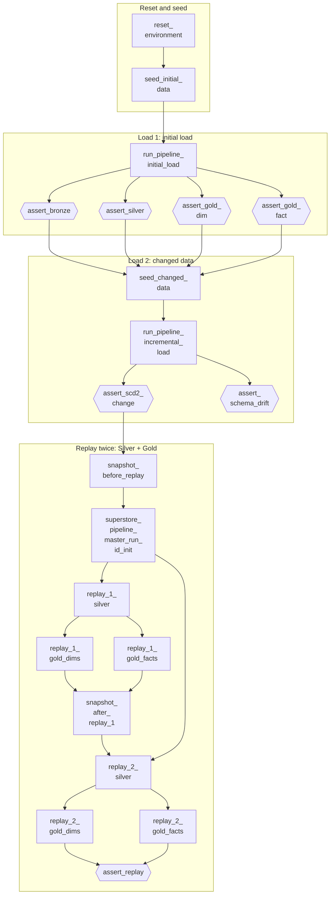

# Testing strategy — unit tests on pure functions, an end-to-end suite on the real pipeline

> Moved out of the top-level README on 2026-10-07 so the README stays a five-minute read. Content unchanged.

## Unit tests (`tests/unit/`) — fast, local, no cluster

Production logic is extracted into **pure functions** ("functional core, imperative shell") so the exact code that runs in production is testable on a local Spark session in seconds:

```bash
pip install -r tests/unit/requirements-unit.txt
pytest tests/unit/ -v
```

Organized by layer (`bronze/`, `silver/`, `gold/`, `shared/`): dedup semantics, DQ rule routing, hash integrity, SCD2 timeline construction, fact column preparation, backfill config parsing. CI blocks every deploy on these.

## Integration test (`tests/integration_databricks/`) — the real pipeline, end to end

A Databricks job (`superstore_integration_test`) that validates the platform the way production would fail:

```
seed dirty data → run REAL pipeline (SUPERSTORE_ENV=integration_test)
  → assert_bronze   (lossless ingest, renames, entity contracts, provenance)
  → assert_silver   (quarantine caught the RIGHT rows, reconciliation, dedup, hashing)
  → assert_gold_dim (SCD2 invariants: one current row, no overlapping ranges)
  → assert_gold_fact (grain uniqueness, referential integrity)
→ seed changed data (incl. a NEW source column) → run pipeline AGAIN
  → assert_scd2_change   (change historized, unchanged rows NOT churned — idempotency)
  → assert_schema_drift  (the new column is detected and recorded)
→ replay the window twice (Silver + Gold only)
  → assert_replay        (re-derivation is idempotent: replay == replay)
(every Silver run also reconciles and records the result to data_quality_checks)
(no end-of-run cleanup — the environment is reset at the START, so a
 failed OR passing run leaves its tables available for post-mortem)
```

Everything runs against isolated `integration_test_*` schemas and a dedicated volume — dev/qa/prod data is never touched. A failed assertion fails the job, which fails CI.

The `superstore_integration_test` job, drawn from [integration_test_job.job.yml](../resources/integration_test_job.job.yml) — 21 tasks; hexagons are assertions. The pipeline runs twice (initial load, then changed data with a new source column), then the window is replayed twice through Silver and Gold to prove re-derivation is idempotent.



*A diagram rather than a screenshot: Databricks draws the 21 tasks as one long row that is unreadable at any size that fits a page, and the screenshot this replaced had gone stale — it still showed replay legs and a `cleanup` task that no longer exist. When the job changes, update this diagram in the same commit. Measured timings: **56.2 min** before scoping the replay legs, **36.6 min** after.*

```bash
databricks bundle run superstore_integration_test --target qa
```
